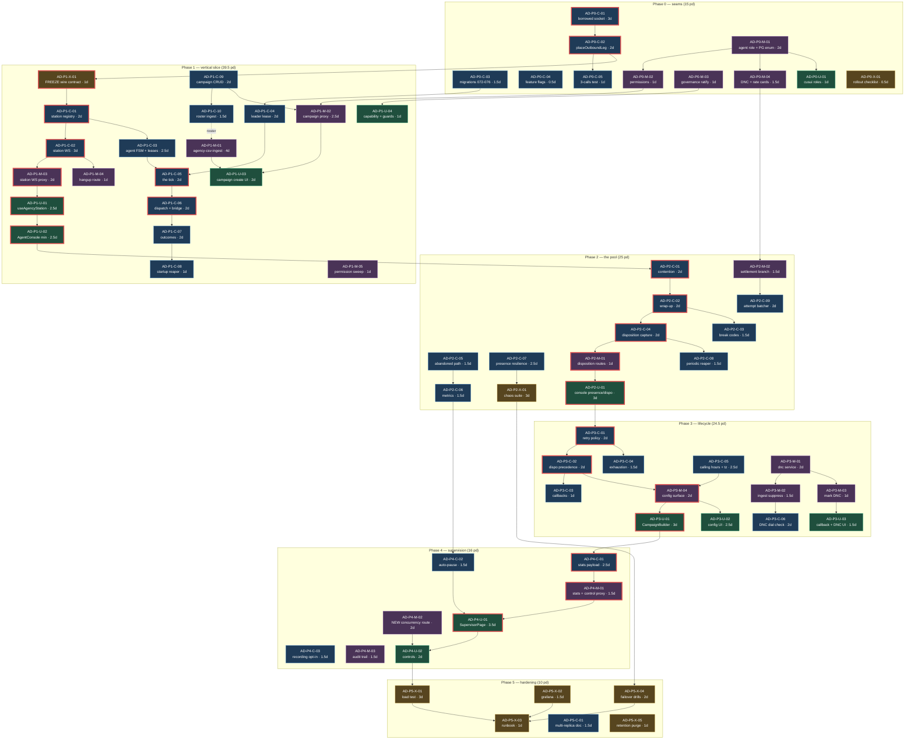

> **Reference copy, verbatim below this box.** Origin: MagickVoice-platform (superproject) @ `e32a5db` (HEAD, 2026-10-05), path `docs/agency-dialer-delivery-plan.md`. Copied into Magick Agency on 2026-10-09; not kept in sync.
>
> **How this maps to Magick Agency:** The ticketed delivery plan for the dialer inside MagickVoice (product-fit audit, backlog, phase gates). Historical context for ticket ids (`AD-P*-*`, `MAG-*`) that appear in ported comments; its phases are not Magick Agency's phases.
>
> Index of all copies: [`docs/reference/README.md`](../../README.md).

# Agency Dialer — Delivery Plan

**Companion to:** [`agency-dialer-design.md`](./agency-dialer-design.md) — that document is authoritative on
architecture. D1–D9 (§0.1) are settled and are treated here as constraints, not options.
**Scope of this document:** product-fit audit, ticketed backlog, dependency graph, phase exit gates,
delivery-risk delta, and the decisions that still need a human.
**Team:** Principal SWE (core), Senior SWE (master + cusui), UX/UI Designer, Principal QA, PM.
**Repos:** `magic-voice-core` v1.72.0 · `magick-master` v1.51.1 · `magick-comms-cusui` v2.41.2, all on `feat/agency-dialer`.

**Headline numbers**

| | |
|---|---|
| Bottom-up estimate (original, Phase 1) | **130 person-days** across 71 tickets |
| **Re-baselined after P0/P1 actuals** (§2.7) | **~186 person-days** across 75 tickets |
| Calendar remaining from Phase 2 start | **~12.5 weeks**, set by the core lane alone (§2.7). The plan as written implies 7.5. |
| Critical path | core bridge refactor → station socket → pacing loop → agent console; master's CSV ingest is the only lane that can start on day 1 in parallel |
| Requirements fully covered | 6 of 9 |
| Requirements partial / late | 3 of 9 (R1 summary surfacing, R3 concurrency affordance, R9 compliance) — none silently dropped |

> **Re-baseline notice (Phase 2 in flight).** Phase 1 delivered at ~62.5 pd against a
> 39.5 pd bottom-up estimate. §2.7 attributes that overrun line by line and applies the
> result to Phases 2–5. The per-phase totals in §2's headers below are the **original**
> bottom-up numbers, kept so the delta stays auditable; §2.7 carries the numbers to plan
> against. Where the two disagree, §2.7 wins.

---

## 1. Product-fit audit

The customer brief had nine functional requirements. Every one traces to a phase and a ticket. Nothing is
silently dropped. Three are partially met at the phase where the customer would first expect them, and one of
those is a genuine hole in the platform rather than a scheduling choice.

The customer's steer — *"in the first iteration we just need the functionality to work; regulations can come
later"* — is applied as the judging rule below. It justifies deferring **enforcement** of compliance
mechanisms; it does not justify deferring anything the operator needs in order to run a campaign at all.

| # | Requirement | Where satisfied | Gap / verdict |
|---|---|---|---|
| **R1** | Campaign + CSV list ingestion, arbitrary columns retained as contact context, E.164 normalization, accepted/rejected/duplicate summary, campaign config | **P1:** `AD-P1-M-01` (streaming `agency-csv-ingest`), `AD-P1-C-10` (chunked roster ingest into `agency_contacts.context` JSONB), `AD-P1-C-09` (campaign CRUD), `AD-P1-U-03` (minimal upload UI). **P3:** `AD-P3-U-01` (column mapping + summary UI), `AD-P3-M-04`/`AD-P3-U-02` (full campaign config) | **Partial in P1.** The accepted/rejected/duplicate summary is *computed* in P1 but only *rendered* in P3; in P1 it is an API response only. Column mapping (which header is the phone number) is a P1 API parameter with no UI until P3, so P1 uploads must be driven by a hand-supplied `phone_column`. Timezone-column mapping (D4) is P3. **Acceptable under the steer** provided the P1 pilot operator is one of us, not the customer. Raise with the customer if they expect to self-serve an upload before P3. |
| **R2** | Agent pool + presence (Offline→Available→Reserved→On Call→Wrap-up→Available, plus Break/Not Ready with reason codes), resilient to tab close / network drop / heartbeat loss | **P1:** `AD-P1-C-01`–`C-03` (station registry, station WS + heartbeat, state machine for offline/available/reserved/on_call with §6.1 lease TTLs). **P2:** `AD-P2-C-02` (wrap-up + timers), `AD-P2-C-03` (break/not-ready + reason codes), `AD-P2-C-07` (resilience), `AD-P2-X-01` (chaos suite) | **Met, completing at end of P2.** The full six-state machine is not demonstrable until P2 exit. That is inherent — wrap-up and break are the states that only matter with more than one agent. No customer-visible deferral. |
| **R3** | Pacing engine — continuous dialing at configured concurrency, pause at zero available agents, resume immediately, single authoritative loop safe against duplicate dialing | **P1:** `AD-P1-C-04` (leader lease), `AD-P1-C-05` (tick + `SKIP LOCKED` claim + unclaim rules), `AD-P1-C-06` (dispatch). Duplicate-dial safety is belt-and-braces: leader lease + `uq_agency_attempt_live` partial unique index (`AD-P0-C-03`) | **Partial — the "configured" half.** The engine is correct, and pause/resume is one expression (§4.2). But D9 routes the concurrency knob to `account_settings.max_concurrent_calls`, and **verified against the tree, that value is editable only through master's super-admin tree** (`magick-master/src/api/routes/super-admin.routes.ts`, calling core's `PUT /internal/account-concurrency`). There is **no `/proxy/account-settings` route** — master's proxy route list has none, and `core-account-settings-sync.service.ts` is an internal push, not a tenant surface. So a tenant-side supervisor cannot configure their own concurrency today. Closed by new ticket `AD-P4-M-02`; see **Q-E**. |
| **R4** | Answer detection + routing to a reserved agent, defined abandoned-call behaviour, classified non-answer outcomes | **P1:** `AD-P1-C-06` (bridge on carrier answer to the pre-reserved agent), `AD-P1-C-07` (outcome classification: `no_answer`/`busy`/`failed`/`invalid`). **P2:** `AD-P2-C-05` (abandoned path + apology clip), `AD-P2-C-06` (rolling 24h rate) | **Met, with one interpretation the customer must hear once.** "Answer detection" means the *carrier answer event*. With AMD out of scope (D1), a voicemail pickup is indistinguishable from a human and is recorded `outcome='connected'`; the only machine signal is the agent's `voicemail` disposition, which drives retry. This is a settled decision, not an open one — but it changes what the connect-rate number means, so it belongs in the customer readout, not just in the design doc. |
| **R5** | Agent screen showing the contact's full CSV row with original headers, rendered **before or simultaneously with** audio connect, plus actions (hang up, disposition, notes, callback, DNC) | **P1:** `AD-P1-C-02` (context pushed on the `reserved` event, before the carrier is dialed — strictly earlier than connect), `AD-P1-U-02` (context table with verbatim headers), `AD-P1-M-04` + `AD-P1-U-02` (hang up). **P2:** `AD-P2-C-04`/`AD-P2-M-01`/`AD-P2-U-01` (disposition + notes). **P3:** `AD-P3-C-03`/`AD-P3-U-03` (callback), `AD-P3-M-03`/`AD-P3-U-03` (mark DNC) | **Met, but the design's phasing had a defect I have corrected.** §11 put disposition capture in Phase 3 while putting wrap-up in Phase 2 — yet §5.1 makes `wrapup → available` conditional on a disposition being submitted. Phase 2 could not have exited. **Disposition capture (catalog validation, submit, notes) is pulled forward into Phase 2** as `AD-P2-C-04`; the *semantics* of dispositions (retry/terminal/suppress precedence, built-in codes) stay in P3 as `AD-P3-C-02`. Callback and DNC actions remain P3. |
| **R6** | Configurable wrap-up window with auto-return | **P2:** `AD-P2-C-02` (`wrapup_seconds`, `wrapup_auto_return`, auto-return driven by an **in-process timer** — the `wrapup` lease is the flat 15s heartbeat TTL per §6.1, never a business number), `AD-P2-U-01` (timer UI) | **Met.** Column ships in migration 072 at P0, behaviour at P2. |
| **R7** | Retry policy per outcome + list exhaustion | **P3:** `AD-P3-C-01` (per-outcome policy → `next_attempt_at`), `AD-P3-C-02` (disposition precedence), `AD-P3-C-04` (exhaustion + completion predicate + single-writer finalization) | **Met.** Note P1 already ships outcome *classification* and campaign completion (without which a P1 campaign never terminates); P3 adds the retry arithmetic on top. Correct sequencing. |
| **R8** | Supervisor dashboard + controls | **P4:** `AD-P4-C-01` (stats payload: contacts remaining, retries pending, in flight, agents by state, connect rate, AHT, avg wrap-up, rolling abandonment), `AD-P4-M-01` (control routes), `AD-P4-U-01`/`U-02` (dashboard + controls). Start/pause/resume/stop routes exist from P1 (`AD-P1-C-09`) but are unexposed to a supervisor UI until P4 | **Partial until R3's gap closes.** "Controls" in the brief includes adjusting pacing live. Under D9 that is the account concurrency setting, which needs the new `AD-P4-M-02` route to be reachable by a supervisor. Everything else is straightforwardly P4. |
| **R9** | Compliance guardrails (DNC, calling hours, audit trail, abandonment metric) | **P2:** `AD-P2-C-06` (abandonment metric). **P3:** `AD-P3-C-05` (calling hours + contact timezone), `AD-P3-C-06`/`AD-P3-M-01`–`M-03` (DNC: table, service, ingest suppression, Redis dial-time check fail-closed, agent mark-DNC). **P4:** `AD-P4-C-02` (auto-pause ceiling), `AD-P4-M-03` (audit trail) | **Deferred, and the deferral is defensible — with one hard condition.** The customer explicitly accepted regulations coming later, so P3/P4 placement is fine. But "later" cannot mean "after we start dialing real people". **The plan therefore adds a non-negotiable gate: no campaign against a real customer contact list before Phase 3 exit.** Until then, dialing is restricted to team-owned test numbers. This is written into the Phase 1 and Phase 2 exit gates. See **Q-F**. |

**Verdict.** Nothing in the brief is dropped. Six requirements are fully covered by the phase where a
customer would expect them. Three are partial:

1. **R3/R8 — live concurrency control has no tenant-facing surface in the platform today.** This is the one
   real hole; the design assumed the setting was already reachable ("already governed") and it is only
   reachable by super-admin. Fixed with a new ticket, and it needs a decision on who may hold that lever (Q-E).
2. **R1 — the ingest summary and column mapping are API-only until P3.** Acceptable if we operate the P1 pilot.
3. **R9 — compliance lands P3/P4.** Explicitly sanctioned by the customer, fenced by a no-real-lists gate.

Everything the customer put out of scope for v1 (AI agents on these calls, inbound/blended queues,
predictive pacing) is out of scope here too, and §11's deferred list adds nothing the customer asked for.

---

## 2. Phase-by-phase backlog

**Conventions.** Ticket id is `AD-P{phase}-{repo}-{nn}`, where repo is `C` = `magic-voice-core`,
`M` = `magick-master`, `U` = `magick-comms-cusui`, `X` = cross-cutting (ops, test, docs; no single repo).
Estimates are person-days for one engineer, and include tests — `npm run lint` is `tsc --noEmit`, and every
ticket is expected to leave all three repos type-clean. Merge order within a phase is **core → master →
cusui** for additive change, which the `depends-on` edges encode.

Owners: `C` tickets → Principal SWE. `M` and `U` tickets → Senior SWE. `X` tickets are shared, with QA
leading the test-suite ones.

---

### Phase 0 — Seams (15 person-days)

Mergeable and invisible to existing users. Nothing here changes an existing behaviour.

| Id | Title | Repo | Est | Depends on |
|---|---|---|---|---|
| `AD-P0-C-01` | Borrowed-socket contract in the bridge session | core | 3 | — |
| `AD-P0-C-02` | Extract `placeOutboundLeg()`; add `createBridgedCall()` | core | 2 | `AD-P0-C-01` |
| `AD-P0-C-03` | Core migrations `072`–`076` | core | 1.5 | — |
| `AD-P0-C-04` | Agency feature flags in the registry | core | 0.5 | — |
| `AD-P0-C-05` | Three-sequential-calls-over-one-socket regression test | core | 1 | `AD-P0-C-02` |
| `AD-P0-M-01` | New `agent` role — Postgres enum + TS union + hierarchy | master | 2 | — |
| `AD-P0-M-02` | Agency permissions in `PERMISSION_MATRIX` + agent-floor regression test | master | 1 | `AD-P0-M-01` |
| `AD-P0-M-03` | Ratify and extend the FROZEN governance catalog | master | 1 | — |
| `AD-P0-M-04` | Master migrations: DNC table + agency rate cards + `DEFAULT_RATES` | master | 1.5 | `AD-P0-M-01` |
| `AD-P0-U-01` | cusui role plumbing for `agent` | cusui | 1 | `AD-P0-M-01` |
| `AD-P0-X-01` | Rollout and deploy-order checklist | shared | 0.5 | — |

**`AD-P0-C-01` — Borrowed-socket contract in the bridge session.** Today `WebRtcBridgeSession.destroy()`
closes both WebSockets, `attachBrowserLeg` registers `message`/`close`/`error` listeners per call, and the
close-handler guard `session.browserWs !== ws` encodes socket-per-call ownership. An agent's station socket
lives for an eight-hour shift across dozens of calls, so all three assumptions break. Introduce explicit
socket ownership (a `BorrowedSocket` wrapper or an `ownsSocket` flag on the session) so `destroy()` detaches
rather than closes, register and tear down listeners per attempt, and add a small control/media multiplexing
envelope so control frames and media frames coexist on one socket. This is the substantial half of Phase 0;
it is not a 60-line extraction.
*Acceptance:* (a) a session constructed with a borrowed socket leaves the socket open after `destroy()`;
(b) after three attach/detach cycles the socket has exactly one listener set per event name; (c) a session
constructed with an owned socket closes it on `destroy()` exactly as today; (d) all existing WebRTC unit and
integration suites pass unchanged, with no edits to their assertions.

**`AD-P0-C-02` — Extract `placeOutboundLeg()`; add `createBridgedCall()`.** Factor the dial, concurrency
acquisition, recording, settlement and analysis path out of `createCall` into a private `placeOutboundLeg()`,
then add `createBridgedCall(params & { browserSocket, campaignId, agencyAttemptId })` which takes an
already-open socket instead of minting one. Both entry points must call exactly one `placeOutboundLeg()`.
*Acceptance:* (a) `createCall` behaviour is byte-identical — same records written, same settlement operation,
same webhook URLs; (b) `createBridgedCall` with a stub socket produces an equivalent `webrtc_calls` row
carrying `campaign_id` and `agency_attempt_id`; (c) a coverage assertion or review checklist item shows no
duplicated dial logic between the two entry points.

**`AD-P0-C-03` — Core migrations `072`–`076`.** Land `agency_campaigns`, `agency_contacts`,
`agency_agent_sessions`, `agency_call_attempts` and the two nullable `webrtc_calls` columns, exactly as §2.1
specifies, including every partial index — in particular `uq_agency_attempt_live` (the duplicate-dial
backstop), `uq_agency_campaign_running` (D9's one-running-campaign rule) and `idx_agency_contacts_dialable`.
Verified against the tree: the highest existing core migration is `071_alert_config.sql`, so `072` is free.
*Acceptance:* (a) migrations apply cleanly on an empty database and on a database restored from a production
dump shape; (b) each partial unique index is proven by a test that attempts the forbidden second insert and
gets a constraint violation; (c) `EXPLAIN` on the dialable predicate uses `idx_agency_contacts_dialable` with
one million rows loaded, of which 99% are terminal.

**`AD-P0-C-04` — Agency feature flags.** Register `agency_dialer_enabled` (bool, default **false**,
`clientExposed: true`), `agency_max_agents_per_campaign` (number, default 100) and
`agency_abandonment_ceiling_pct` (number, default 3) in `src/feature-flags/registry.ts`, following the
existing entry shape.
*Acceptance:* (a) `GET /proxy/feature-flags` returns `agency_dialer_enabled: false` for every existing
tenant; (b) the two numeric flags are not client-exposed; (c) no agency route is registered when the flag is
off — assert by hitting one and getting the platform's standard disabled response.

**`AD-P0-C-05` — Three-sequential-calls-over-one-socket regression test.** The named regression bar from §7.
Drive three complete bridged calls over a single station socket and assert the socket is still open and
carries exactly one live listener set after the third.
*Acceptance:* (a) the test fails against `main` and passes after `AD-P0-C-01`/`C-02`; (b) it asserts listener
counts numerically, not by absence of a warning; (c) it runs in the standard `npm test` unit suite without
Docker.

**`AD-P0-M-01` — New `agent` role.** Add `agent` at hierarchy level 5 in `src/rbac/roles.ts`, to the
`MembershipRole` union in `src/db/models/membership.model.ts:1`, and to `super-admin.validator.ts`'s role
enum. **The design under-scoped this: `membership_role` is a Postgres `ENUM` type created in
`001_initial_schema.sql`, not a free-text column** — so this needs a real master migration
(`051_membership_role_agent.sql`, already present in the working tree) doing
`ALTER TYPE membership_role ADD VALUE 'agent'`, and that statement
cannot have its new value used inside the same transaction that adds it. Confirm the migration runner's
transaction handling and, if it wraps each file, split the enum change and any use of it into two files.
Decide deliberately whether `agent` joins `user.validator.ts`'s invite enums (currently
`['account_admin','operator','viewer']` and `['tenant_admin','account_admin','operator','viewer']`) — it must,
or agents cannot be invited.
*Acceptance:* (a) migration applies and rolls forward on a database with existing memberships; (b) a
membership can be created with role `agent` through the invite flow; (c) `ROLE_HIERARCHY.agent === 5`;
(d) no existing role's level or any existing permission floor changes — asserted by a snapshot test of
`PERMISSION_MATRIX`.

**`AD-P0-M-02` — Agency permissions + agent-floor regression test.** Add the four agent-floor permissions
(`agency.station.connect`, `agency.attempts.handle`, `agency.attempts.dispose`, `agency.dnc.write`) and the
four supervisory ones (`agency.campaigns.read` → viewer, `agency.campaigns.write` → account_admin,
`agency.campaigns.control` → operator, `agency.supervise` → account_admin) to `Permission` and
`PERMISSION_MATRIX`.
*Acceptance:* (a) a test enumerates every permission and asserts an `agent` membership resolves to **exactly**
the four `agency.*` agent-floor permissions and nothing else; (b) the same test asserts `operator` and above
retain every permission they had before this change; (c) `account_admin` inherits all eight agency permissions.

**`AD-P0-M-03` — Ratify and extend the FROZEN governance catalog.** `src/governance/catalog.ts` carries an
explicit "do not edit without a contract change" header. Obtain and record the ratification (the `escalation`
node at `catalog.ts:46` is the precedent), then add `agency`, `agency.recording` and `agency.analytics`, all
`default: false`, `mandatory: false`.
*Acceptance:* (a) the three nodes exist with `default: false` and correct `parent` links; (b)
`GET /governance/effective` returns them false for a tenant with no overrides; (c) the ratification is
recorded in the file header or the PR description with a named approver and date; (d) existing capability
defaults are unchanged, asserted by a snapshot test.

**`AD-P0-M-04` — Master migrations: DNC + rate cards.** `050_dnc.sql` per §2.3, including the extra plain
`(tenant_id, phone_e164)` index the `COALESCE` unique index cannot serve. `052_agency_rate_cards.sql` seeding
`agency_connected_call` (unit `call`, 25 millicredits) and `agency_dial_attempt` (unit `attempt`, batched),
with matching entries in `rate-card.service.ts`'s `DEFAULT_RATES` so a settlement arriving in the
deploy/rollback window is not priced at the 500mc fallback — exactly the reasoning already written into that
file for `kb_search` and `dialer_analysis`. The design's `050_dnc.sql` numbering holds; the enum migration
from `AD-P0-M-01` takes `051`, which is safe only because nothing in `050` or `052` inserts a membership with
the new role — verify that stays true.
*Acceptance:* (a) both migrations apply on a database at `049`; (b) `getRate('agency_connected_call')`
returns `25n` both from the seeded row and from `DEFAULT_RATES` with the DB row removed; (c) the DNC unique
index rejects a duplicate tenant-wide entry and permits the same number under a different account scope.

**`AD-P0-U-01` — cusui role plumbing.** Add `agent` to `Role` (`src/types/auth.ts:41`), `ROLE_LEVELS`
(`src/utils/permissions.ts:3`) at 5, the role-label list in `src/config.ts:378`, and the `ROLES` array in
`SATenantDetailPage.tsx:27`. Several existing tests enumerate every role
(`__tests__/utils/permissions.test.ts`, `sipPermissions.test.ts`'s `ALL_ROLES`, `DashboardPage.test.tsx`'s
`it.each<Role>`) and will need the new member — budget for that, it is the bulk of this ticket.
*Acceptance:* (a) `tsc --noEmit` clean; (b) all cusui unit tests green with `agent` added to every role
enumeration; (c) `hasPermission('agent', p)` is false for every pre-existing permission, asserted
exhaustively; (d) the role picker renders a label for `agent`.

**`AD-P0-X-01` — Rollout and deploy-order checklist.** Write the operational checklist §8 asks for as a
checklist rather than prose: master's settlement branch and both rate-card rows deployed **before**
`agency_dialer_enabled` is turned on for any tenant, because master's unified settlement endpoint 400s on an
unknown `call_type` (`webhook-core.routes.ts:1067`) and every agency call would fail to settle. Include the
core → master → cusui merge order, the paired-secret checks, and the enum-migration ordering from
`AD-P0-M-01`.
*Acceptance:* (a) the checklist exists in the repo and is linked from the phase's PR template or the runbook
stub; (b) it names, per step, who executes it and how to verify; (c) a dry run against staging ticks every box.

---

### Phase 1 — The vertical slice (39.5 person-days)

One campaign, one agent, one list. No retries, no DNC, no calling hours, no supervisor UI, no wrap-up.

| Id | Title | Repo | Est | Depends on |
|---|---|---|---|---|
| `AD-P1-X-01` | Freeze the station-socket envelope and agency route contract | shared | 1 | `AD-P0-C-03` |
| `AD-P1-C-01` | Station registry + Redis ownership key | core | 2 | `AD-P1-X-01` |
| `AD-P1-C-02` | Station WebSocket route, control/media envelope, heartbeat | core | 3 | `AD-P1-C-01`, `AD-P0-C-01` |
| `AD-P1-C-03` | Agent state machine + §6.1 lease lifecycle (P1 subset) | core | 2.5 | `AD-P1-C-01` |
| `AD-P1-C-04` | Pacing engine: leader lease + per-campaign supervisor | core | 2 | `AD-P0-C-03` |
| `AD-P1-C-05` | The tick: claim, target, unclaim rules | core | 2 | `AD-P1-C-04`, `AD-P1-C-03` |
| `AD-P1-C-06` | `DialDispatcher` + `LocalDialDispatcher` + bridge on answer | core | 2 | `AD-P1-C-05`, `AD-P0-C-02` |
| `AD-P1-C-07` | Outcome classification from carrier events | core | 2 | `AD-P1-C-06` |
| `AD-P1-C-08` | Startup reaper | core | 1 | `AD-P1-C-07` |
| `AD-P1-C-09` | Campaign CRUD + lifecycle routes + repository | core | 2 | `AD-P0-C-03` |
| `AD-P1-C-10` | `POST /internal/agency-campaigns/:id/contacts` chunked roster ingest | core | 1.5 | `AD-P1-C-09` |
| `AD-P1-M-01` | `agency-csv-ingest` — streaming parser with column mapping and dedupe | master | 4 | — |
| `AD-P1-M-02` | `agency-campaign.service` + `/proxy/agency-campaigns/*` | master | 2.5 | `AD-P1-C-09`, `AD-P0-M-02` |
| `AD-P1-M-03` | Station WebSocket proxy with query-string token | master | 2 | `AD-P1-C-02` |
| `AD-P1-M-04` | Agent-native action routes — hang up | master | 1 | `AD-P1-C-02`, `AD-P0-M-02` |
| `AD-P1-M-05` | Permission sweep: no pre-existing `/proxy/*` route is reachable by `agent` | master | 1 | `AD-P0-M-02` |
| `AD-P1-U-01` | `useAgencyStation` hook | cusui | 2.5 | `AD-P1-M-03` |
| `AD-P1-U-02` | `AgentConsolePage` — minimal | cusui | 2.5 | `AD-P1-U-01` |
| `AD-P1-U-03` | Minimal campaign create + CSV upload UI | cusui | 2 | `AD-P1-M-02`, `AD-P1-M-01` |
| `AD-P1-U-04` | `RequireCapability` union, route guards, Vite WS proxy | cusui | 1 | `AD-P0-M-03` |

**`AD-P1-X-01` — Freeze the station-socket envelope and agency route contract.** Before either engineer
writes a line of Phase 1, publish the wire contract as TypeScript types plus a short markdown table: every
station-socket control frame (`reserved`, countdown, `bridged`, `released`, `hangup`, heartbeat), the
`agency_contacts.context` payload shape, and the request/response shape of every `/api/v1/agency*` and
`/internal/agency*` route. This is the single highest-leverage ticket in the plan: it is what lets the Senior
SWE build master's proxy and cusui's hook against a stable target instead of waiting for core to land.
*Acceptance:* (a) the contract is committed in core and referenced by master and cusui tickets; (b) every
control frame has a discriminated-union type with an example payload; (c) both engineers sign off before P1
implementation starts; (d) any later change to it is a PR that both must approve.

**`AD-P1-C-01` — Station registry + Redis ownership key.** The `agency:station:{sessionId} →
{replicaId, advertisedHost}` key with a 30s TTL, written on socket accept, renewed by the socket's own
heartbeat, expiring on close or heartbeat lapse. Per D2 the routing that consumes this is not built, but the
key **is** written and read on every reservation so the invariant is exercised from day one.
*Acceptance:* (a) opening a station socket writes the key with the correct TTL; (b) three missed heartbeats
expire it; (c) the reservation path reads it and refuses to reserve an agent whose key is absent; (d) a
unit test proves the "no key ⇒ not available" path without a real socket.

**`AD-P1-C-02` — Station WebSocket route, control/media envelope, heartbeat.** `WS /api/v1/agency/station/
:sessionId` with per-route auth (core registers auth per route-plugin, never globally — forgetting it ships
an unauthenticated endpoint), the multiplexing envelope from `AD-P0-C-01`, a 10s ping, and the `reserved`
event carrying the contact's full context. The context push at reservation is what satisfies R5's ordering
guarantee, so it is part of this ticket, not the bridge ticket.
*Acceptance:* (a) an unauthenticated connection is rejected; (b) the socket survives an attach/detach cycle
of a bridged call; (c) the `reserved` frame is emitted before `initiateCall` is invoked, asserted by ordering
in a test, not by timing; (d) three missed pings close the socket and mark the session `offline`.

**`AD-P1-C-03` — Agent state machine + §6.1 lease lifecycle (P1 subset).** `offline → available → reserved →
on_call → available` with the Redis CAS reservation script from §6 and the per-state TTLs from §6.1 —
critically, the TTL tracks the *agent state*, not the reservation as a whole, and is renewed by the owning
replica every 5s while the attempt is non-terminal. A single 20s lease covering a whole dial is the bug §6.1
exists to prevent. `wrapup` and `break` are out of scope here (P2).
*Acceptance:* (a) two concurrent reservations of one agent produce exactly one winner, proven by a
concurrent test, not a sequential one; (b) a lease is never observed expiring while its renewer is alive,
across a 60s soak with an attempt held in `ringing`; (c) killing the renewer expires the lease within TTL and
returns the agent to `available` with the attempt marked `failed`; (d) no business timer is implemented as a
Redis TTL — asserted by review checklist and a comment on each TTL constant.

**`AD-P1-C-04` — Pacing engine: leader lease + per-campaign supervisor.** The 2s supervisor that attempts
`SET agency:leader:{campaignId} {replicaId} NX PX 15000` for each `running` campaign it does not lead, renews
at 5s, and stops its tick loop within one tick of losing renewal. Same Redis-Lua idiom as `ConcurrencyGuard`.
*Acceptance:* (a) with two simulated leaders, exactly one holds the lease at any instant; (b) revoking the
lease externally stops the tick loop within 250ms + one tick; (c) a campaign transitioning out of `running`
releases its lease.

**`AD-P1-C-05` — The tick: claim, target, unclaim rules.** The 250ms tick computing
`to_dial = MAX(0, MIN(account_settings.max_concurrent_calls − occupied, idle_agents))`
where `occupied` counts **all** non-terminal attempts (a bridged call
still holds a concurrency slot), plus the `FOR UPDATE SKIP LOCKED` claim. Implement the §4.2 unclaim rules
even though their triggers (calling hours, DNC) arrive in P3 — the "reservation lost" case is live in P1, and
getting the clock-forward discipline right now avoids a spin-loop retrofit later.
*Acceptance:* (a) with zero available agents, zero dials are attempted and no contacts are claimed;
(b) an agent becoming available results in a dial within one tick; (c) two leaders forced to race the same
campaign claim disjoint contact sets — no contact is claimed twice; (d) an unclaimed contact never satisfies
the dialable predicate immediately after unclaim unless its blocking condition genuinely cleared.

**`AD-P1-C-06` — `DialDispatcher` + `LocalDialDispatcher` + bridge on answer.** The dispatch interface whose
only v1 implementation is a direct in-process call (D2), reserving the agent strictly before `initiateCall`,
then calling `createBridgedCall` with the agent's live station socket on the carrier answer event. Emits
`bridged` on the station socket.
*Acceptance:* (a) reservation is provably ordered before the carrier is contacted; (b) an answered call
bridges to the reserved agent and to no one else; (c) the `webrtc_calls` row carries `campaign_id` and
`agency_attempt_id`; (d) `DialDispatcher` has no local-only assumptions in its signature — a reviewer can
describe how `PubSubDialDispatcher` would slot in without changing callers.

**`AD-P1-C-07` — Outcome classification from carrier events.** Map carrier lifecycle events onto
`no_answer` / `busy` / `failed` / `invalid` and write the attempt terminal. Retries are out of scope for P1,
but classification is not: without it a non-answered call never leaves `in_flight` and the campaign never
completes.
*Acceptance:* (a) each of the four outcomes is produced by a simulated carrier event in a test; (b) every
terminal attempt releases its agent reservation and its telephony concurrency slot; (c) a contact whose
attempt ended non-answered leaves `in_flight`.

**`AD-P1-C-08` — Startup reaper.** At boot, in one transaction before the pacing supervisor starts: every
non-terminal attempt → `failed` with `outcome='orphaned'`, its contact → `pending`, every agent session →
`offline`. Under D2 any non-terminal row at boot is dead by definition. Cheap, and without it a single crash
during Phase 1 testing quietly poisons the roster.
*Acceptance:* (a) `kill -9` mid-dial followed by a restart leaves zero rows in `in_flight` and zero
non-terminal attempts; (b) the reaper runs to completion before the first tick; (c) it is idempotent — a
second run is a no-op.

**`AD-P1-C-09` — Campaign CRUD + lifecycle routes + repository.** `POST/GET/PATCH /api/v1/agency-campaigns`
and `POST /api/v1/agency-campaigns/:id/{start,pause,resume,stop}`, with the D9 one-running-campaign-per-account
constraint surfaced as a clean 409 rather than a raw constraint error, and the single-writer finalization
rule (only the pacing leader writes `running → completed` and `stopping → stopped`).
*Acceptance:* (a) starting a second campaign on an account that already has one running returns 409 with an
actionable message; (b) `stop` sets `stopping`, in-flight attempts drain, and the leader's next idle tick
finalizes to `stopped`; (c) no code path other than the leader writes those two transitions, asserted by a
repository-level guard or test.

**`AD-P1-C-10` — Chunked roster ingest endpoint.** `POST /internal/agency-campaigns/:id/contacts` accepting
chunks of 500 rows over the S2S channel, writing `agency_contacts` with `context` holding every non-phone CSV
column verbatim under its original header, and maintaining `contacts_total`.
*Acceptance:* (a) a 100k-row roster ingests in chunks with no memory growth proportional to roster size;
(b) re-delivering a chunk is idempotent (source row number keyed); (c) original headers survive round-trip
including ones with spaces, unicode, and duplicate-ish casing; (d) the endpoint rejects a request without the
S2S token.

**`AD-P1-M-01` — `agency-csv-ingest`.** The four blockers verified in the tree: `MAX_ROWS = 10_000`
(`csv-parser.ts:4`), whole-file buffering via `parse(buffer)` from `csv-parse/sync`, the phone column being
required to literally be named `phone` (`csv-parser.ts:76`), and duplicates producing only a warning string.
Write a **new** `agency-csv-ingest.ts` beside the existing parser — do not modify it; the 10k synchronous path
serves bulk dispatch correctly and must absorb none of this risk. Streaming S3 read piped into non-sync
`csv-parse` with a row callback, an operator-supplied `phone_column`, in-stream dedupe on normalized E.164,
and a structured `{accepted, rejected, duplicates, errors[]}` summary. Then stream accepted rows to core in
500-row chunks reusing the `chunked-dispatch.ts` pattern.
*Acceptance:* (a) a 1M-row CSV ingests with bounded memory — assert peak RSS stays under a fixed ceiling,
not merely that it completes; (b) `accepted + rejected` equals the data row count exactly — `duplicates` is a
breakdown of `rejected`, never a fourth addend — for
several fixtures including one with a trailing newline and one with a BOM; (c) an arbitrarily-named phone
column works; (d) the existing `csv-parser.ts` and its tests are untouched and green; (e) an S3 read failure
mid-stream fails the job with a resumable error rather than a partial roster silently marked complete.

**`AD-P1-M-02` — `agency-campaign.service` + proxy routes.** Master owns the campaign as a business object;
this service creates the execution object in core, streams the roster, and proxies campaign CRUD and
lifecycle with the standard tenant/account header translation. Gated at `agency.campaigns.write` /
`.control` / `.read` and the `agency` capability.
*Acceptance:* (a) a campaign created through master exists in core with matching config; (b) an `agent`-role
caller gets 403 on every campaign route; (c) a `viewer` can read but not start; (d) core's 409 on a second
running campaign is surfaced intact, not swallowed into a 500.

**`AD-P1-M-03` — Station WebSocket proxy with query-string token.** Modeled on
`proxy-media-stream.routes.ts` (which is deliberately unauthenticated — a long-lived agent socket cannot be),
appending `?token=` while preserving any existing query string, and gated at `agency.station.connect`.
*Acceptance:* (a) a connection without a valid token is rejected before reaching core; (b) an existing query
string is preserved when the token is appended; (c) frames pass through in both directions with no
buffering-induced reordering; (d) proxy teardown on master restart closes the client socket cleanly rather
than leaving it half-open.

**`AD-P1-M-04` — Agent-native hang-up route.** `POST /proxy/agency/attempts/:id/hangup` gated at
`agency.attempts.handle`. The existing `POST /proxy/webrtc-call/:id/end` cannot be reused: it floors at
`proxy.calls.create` → `operator` (20) (`proxy-webrtc-call.routes.ts:239`), and D6 places `agent` at 5 below
every pre-existing floor. The agency-native route is better anyway because core can verify the caller **is**
the reserved agent for that attempt.
*Acceptance:* (a) the reserved agent can hang up their own attempt; (b) a different agent gets 403 on that
attempt; (c) hang-up is idempotent; (d) an `operator` can also hang up, for supervisory cover.

**`AD-P1-M-05` — Permission sweep.** Systematically walk every `/proxy/*` route that predates this feature
and assert none is reachable by an `agent`. §9 states the rule; this ticket proves it mechanically rather
than by inspection, because it is the kind of invariant that silently rots.
*Acceptance:* (a) an automated test enumerates registered proxy routes and asserts each one's permission
floor is above `agent`; (b) the test fails if a future route is added with an agent-reachable floor without
an explicit allowlist entry; (c) the allowlist starts containing only the agency-native routes.

**`AD-P1-U-01` — `useAgencyStation` hook.** Station WS lifecycle, 10s heartbeat, reconnect with exponential
backoff, `beforeunload` graceful leave, and the discriminated-union frame handling from `AD-P1-X-01`.
*Acceptance:* (a) a dropped socket reconnects with backoff and rehydrates the session rather than creating a
new one; (b) after a reconnect following a service restart the agent is in `break`, never `available`
(D2's consequence); (c) closing the tab sends a graceful leave; (d) unit tests cover each frame type.

**`AD-P1-U-02` — `AgentConsolePage` minimal.** Go available, receive a reserved event, render the context
table with verbatim CSV headers, hear the 3-2-1 countdown (D5 — no accept button), see the panel switch live
on `bridged`, hang up.
*Acceptance:* (a) the context panel is on screen before the `bridged` frame arrives, asserted by event order
in a test; (b) headers render verbatim including unusual characters; (c) the countdown plays locally and is
not transmitted to the customer; (d) the panel clears on `released` when a call never connects.

**`AD-P1-U-03` — Minimal campaign create + CSV upload UI.** Enough to create a campaign, upload a file and
pick the phone column — deliberately unstyled beyond platform defaults; the designed builder is `AD-P3-U-01`.
*Acceptance:* (a) an operator can go from zero to a running 50-row campaign without touching an API client;
(b) the ingest summary is displayed even if only as raw counts; (c) it is behind the `agency` capability and
`agency.campaigns.write`.

**`AD-P1-U-04` — Capability union, route guards, Vite WS proxy.** Add `'agency'` and children to the
hand-maintained `KnownCapabilityGate` union in `RequireCapability.tsx` (verified: it is a hand-maintained
literal union plus a `Set`, so both need the new members), wire `RequireAuth`, and add the station WS entry to
the Vite proxy with `ws: true` alongside the existing two.
*Acceptance:* (a) a tenant without the `agency` capability sees the unavailable state, not a crash;
(b) `RequireCapability` still fails open on unknown gates, as designed, because master's 403 is the real
enforcement; (c) the station socket works through `npm run dev` locally.

---

### Phase 2 — The pool (25 person-days as originally estimated; **42 re-baselined** — see §2.7)

Multiple agents, real contention. This is the phase that earns the design.

| Id | Title | Repo | Est | Re-b. | Depends on |
|---|---|---|---|---|---|
| `AD-P2-C-01` | Multi-agent reservation contention + candidate selection | core | 2 | 3.2 | `AD-P1-C-03`, `AD-P1-C-05` |
| `AD-P2-C-02` | Wrap-up state, timers, auto-return | core | 2 | 2.6 | `AD-P2-C-01` |
| `AD-P2-C-03` | Break / not-ready with reason codes | core | 1.5 | 1.65 | `AD-P2-C-02`, `AD-P2-C-10` |
| `AD-P2-C-04` | Disposition capture — catalog validation, submit, notes **(pulled forward from P3)** | core | 2 | 2.6 | `AD-P2-C-02` |
| `AD-P2-C-05` | Abandoned-call path + apology clip | core | 1.5 | 1.95 | `AD-P1-C-06` |
| `AD-P2-C-06` | Prometheus counters + rolling 24h abandonment rate | core | 1.5 | 1.95 | `AD-P2-C-05` |
| `AD-P2-C-07` | Presence resilience: heartbeat loss, **deferred-hangup timer (new)**, restart rehydration | core | 3.5 | 5.6 | `AD-P1-C-02` |
| `AD-P2-C-08` | Periodic reaper + `no_disposition` sweep | core | 1.5 | 2.4 | `AD-P1-C-08`, `AD-P2-C-04` |
| `AD-P2-C-09` | Hourly `agency_dial_attempt` batcher with remainder carry | core | 2 | 3.2 | `AD-P2-M-02` |
| **`AD-P2-C-10`** | **New:** break-reason catalog — storage, seeded defaults, server-side validation | core | 1.5 | 1.65 | `AD-P1-C-09` |
| `AD-P2-M-01` | Disposition + notes proxy routes | master | 1 | 1.1 | `AD-P2-C-04` |
| `AD-P2-M-02` | Settlement branch — agency operations, not `webrtc_call` | master | 1.5 | 1.95 | `AD-P0-M-04` |
| `AD-P2-U-01` | Agent Console: presence controls, wrap-up timer, disposition form, notes | cusui | 3 | 3.9 | `AD-P2-M-01` |
| **`AD-P2-U-02`** | **New:** audio connect cue + hold-to-confirm hang-up | cusui | 2 | 2.0 | `AD-P1-U-02`, UX spec §A.3.1 |
| `AD-P2-X-01` | Chaos test suite | shared | 3 | 4.8 | `AD-P2-C-07` |
| **`AD-P2-X-02`** | **New:** cross-service chunk idempotency — kill master mid-ingest | shared (QA) | 1.5 | 1.5 | `AD-P1-C-10`, `AD-P1-M-01` |

**Three of these ids are new, and all three existed as work before they existed as
tickets.** `C-10`, `U-02` and `X-02` are §3 of the session-state handoff plus one gap
nobody had written down. Untracked work is work that gets dropped at the gate and
rediscovered in the phase after, so they carry ids and estimates here even though two
of them are small. The fourth carried gap — the deferred-hangup timer — is already
folded into `AD-P2-C-07`'s 3.5 days and correctly needs no ticket of its own.

**`AD-P2-C-01` — Multi-agent reservation contention.** Candidate selection across a pool (longest-idle-first
is the sane default and costs nothing), with the CAS losing gracefully and moving to the next candidate.
*Acceptance:* (a) with 5 agents and 5 concurrent reservations, each agent is reserved exactly once; (b) a lost
CAS never consumes a claimed contact — the contact is either dialed or unclaimed with the clock moved
forward; (c) selection is fair enough that no agent's idle time diverges over a 200-call run.

**`AD-P2-C-02` — Wrap-up state, timers, auto-return.** `on_call → wrapup → available` honouring
`wrapup_seconds` and `wrapup_auto_return`, with auto-return driven by an **in-process timer**. Where a
disposition is required, the timer extends and a supervisor can force return. The business timer lives in the
attempt row and in process, **never in the Redis TTL** — §6.1's `wrapup` row is the flat 15s heartbeat lease,
identical to `available`, and its expiry means the process died, not that wrap-up finished.
*Acceptance:* (a) `wrapup_seconds = 0` sends the agent straight to `available`; (b) with auto-return on, the
agent returns exactly once at expiry; (c) with a required disposition outstanding, the agent does not
auto-return and the reason is visible in their UI; (d) an agent in wrap-up is not counted as available by the
tick.

**`AD-P2-C-03` — Break / not-ready with reason codes.** `* → break` with an operator-configured reason code
list, queued when the agent is `on_call` and applied at the end of wrap-up. **Depends on `AD-P2-C-10` for the
list it validates against** — see that ticket for why this dependency was missing.
*Acceptance:* (a) requesting a break mid-call does not interrupt the call and takes effect after wrap-up;
(b) an agent in `break` is never reserved; (c) the reason code is persisted on the session and is visible for
reporting; (d) an unknown reason code is rejected.

**`AD-P2-C-10` — Break-reason catalog (new; found while re-baselining Phase 2).** `AD-P2-C-03` requires "an
operator-configured reason code list" and its acceptance criterion (d) rejects "an unknown reason code" — but
**nothing in the plan creates that list.** The design has only
`agency_agent_sessions.break_reason VARCHAR(50)` (§2.1), a free-text column; there is no catalog, no
configuration surface and no validation anywhere in the 71 tickets. The UX spec reached the same conclusion
independently and files it as still-open-blocking (§E.1 item 4: "The Break menu has nothing to render and the
supervisor's break breakdown has nothing to group by").

This is the same defect class as **D-8**: a Phase 2 exit criterion whose enabling work was never ticketed.
Phase 2 exit criterion 2 requires break with a reason code to be entered and left correctly, and it is not
demonstrable against a free-text column.

Scope deliberately kept to the *mechanism*, not the editor. Ship the catalog **account-scoped** — an agent
goes on break as an agent, not as a participant in a campaign, and can be on break while no campaign runs at
all, so `agency_campaigns` is the wrong home despite the symmetry with `disposition_catalog`. Seed a default
list (lunch, training, meeting, technical issue, other), validate server-side on the break control frame, and
return the list in the station bootstrap so the console renders the menu from the server rather than from a
client-side constant. **The editor UI is not in this ticket** — it is folded into `AD-P3-U-02` (+0.5d) where
the disposition-catalog editor already lives; until then the seeded defaults are edited by migration.
*Acceptance:* (a) the break control frame is rejected server-side with a typed error when the reason is not in
the account's catalog, and free text can never reach the column; (b) the bootstrap carries the catalog and the
console renders from it — asserted by changing the catalog and seeing the menu change with no client rebuild;
(c) an account with no explicit catalog resolves to the seeded defaults rather than to an empty menu;
(d) the persisted reason is groupable for the Phase 4 supervisor breakdown, proven by the aggregate query.

**`AD-P2-U-02` — Audio connect cue + hold-to-confirm hang-up (new; carried gap from Phase 1).** Both are
specified in the UX spec and shipped as zero. QA's framing is the one to hold: this is an **untested surface,
not a passed one** — nothing demonstrated so far proves the agent *notices* the connect, and the requirement
is a **timing** requirement, so it cannot be signed off by a screenshot.

The cue must fire on **`bridged`, never on `status: 'answered'`** — UX spec §A.3.1 makes this the load-bearing
distinction and it is the whole reason the frame split exists. `answered` means the carrier reports off-hook;
`bridged` means audio is flowing to *this agent's* socket. Between them sit the borrowed-socket attach, the
listener registration, and the reserved-agent ownership check, all of which can fail. A cue on `answered`
tells the agent "a human is on the line" while they are on dead air — precisely the failure the connect design
exists to prevent, reintroduced by reading the wrong frame. Hold-to-confirm hang-up needs a keyboard-reachable
equivalent; the console's no-mouse requirement (`AD-P2-U-01` acceptance (d)) is not waived for a press-and-hold
gesture.
*Acceptance:* (a) the cue is driven by the `bridged` frame and by nothing else, asserted by dispatching
`status: 'answered'` alone and proving silence; (b) the latency from `bridged` to audible cue is measured and
stated, not assumed — with a ceiling agreed with UX and asserted in the test; (c) the cue degrades to the
other three channels when the browser blocks autoplay, and the console detects and reports that state rather
than failing silently; (d) hold-to-confirm has a keyboard path and a screen-reader-announced progress state;
(e) an accidental single click never ends a call.

**`AD-P2-X-02` — Cross-service chunk idempotency (new; carried gap, QA-led).** Both halves are already tested
in isolation: core's `(campaign_id, source_row_number)` constraint (migration `077_agency_ingest_chunks.sql`,
which the original plan did not anticipate — it budgeted `072`–`076`) and QA's **C21** at the integration tier.
The untested failure is the **cross-service** one and it is the one that actually happens: master dies *after*
core committed a chunk and *before* master recorded that it did. Neither repo's suite can see it, because
neither repo is where it goes wrong. First job of Phase 2.
*Acceptance:* (a) the scenario is scripted — kill master mid-ingest, restart, re-run the job — not a manual
procedure; (b) core's contact count after re-run is unchanged, asserted against the database; (c) the ingest
job's own accepted/rejected/duplicate summary reconciles after the restart, so the operator is not shown a
number that disagrees with the roster; (d) the run is repeatable in CI alongside `AD-P2-X-01`.

**`AD-P2-C-04` — Disposition capture (pulled forward).** Validate a submitted disposition against
`campaign.disposition_catalog`, persist `disposition_code` and `notes` on the attempt, and release wrap-up.
The *semantics* of dispositions — the `retry`/`terminal`/`suppress` precedence and the three built-in codes —
are `AD-P3-C-02`; this ticket is capture only. **This move corrects a sequencing defect in design §11**,
where wrap-up (P2) depended on a disposition (P3).
*Acceptance:* (a) a code not in the catalog is rejected with a clear error; (b) `requires_note` is enforced;
(c) the disposition is written before the agent returns to `available`; (d) only the reserved agent for that
attempt may disposition it.

**`AD-P2-C-05` — Abandoned-call path.** Carrier reports answer, the owning replica finds no live reserved
station: play the apology clip through the existing static-clip path
(`src/services/static-clip-resolver.ts` + `src/audio/telephony-clip.ts`, both verified present), hang up,
write `outcome='abandoned'`. Under D1 this is reachable only through reserved-agent loss — build it anyway;
it is the safety net predictive pacing will need and it is far cheaper now than retrofitted onto a system
that has never exercised it.
*Acceptance:* (a) injecting agent loss during ring produces exactly this sequence; (b) the clip plays to
completion before hang-up; (c) the attempt is `abandoned`, not `failed`; (d) the customer never hears
silence longer than the clip's own latency.

**`AD-P2-C-06` — Prometheus counters + rolling abandonment rate.** `agency_abandoned_total` and
`agency_answered_total`, surfaced as a rolling **24h** rate — the window regulators measure over, not a
session or a campaign.
*Acceptance:* (a) both counters increment correctly under the injected-abandonment test; (b) the rolling rate
is computed over 24h and is correct across a restart; (c) the series appear on core's metrics port (9090).

**`AD-P2-C-07` — Presence resilience.** Heartbeat loss, browser tab close, laptop lid, network drop during
ring, and process restart all resolved through the same mechanism: the Redis key expires, which is what
removes the agent from the available count; the DB row is updated by a sweeper and is never relied on for
liveness. **Build the deferred-hangup timer — it does not exist.** An earlier design draft claimed the bridge
already had a re-attach grace window; design §7 now records that it does not. `webrtc-bridge-manager.ts:379-384`
is not a timer: it only handles a *new* socket attaching while the prior one is still open. On a real network
drop the old socket's `close` fires first and `localHangup(…, 'browser_hangup')` has already killed the call
before any reconnect arrives. So a wifi blip surviving is **new work in this ticket**, which is why the
estimate moved from 2.5 to 3.5 days. On timer absence or exhaustion, hang up the carrier leg with
`outcome='agent_disconnected'`. On restart, rehydrate sessions from `agency_agent_sessions` and land the agent
in `break`, never `available`.
*Acceptance:* (a) each of the five failure modes produces the correct terminal state, each proven by its own
test; (b) a reconnect inside the deferred-hangup window resumes the same call with audio intact, and one
outside it finds the call already settled as `agent_disconnected`; (c) after a core restart every returning
agent is in `break` and the campaign auto-resumes only once agents go available; (d) no code path derives
availability from the DB row; (e) the deferred-hangup window is **not** implemented as a Redis TTL — it is an
in-process timer, per §6.1's invariant.

**`AD-P2-C-08` — Periodic reaper + `no_disposition` sweep.** The 60s pass over attempts non-terminal longer
than `max_ring + max_call_duration` with no live bridge, plus contacts stuck in `connected` past the wrap-up
window whose attempt ended without a disposition — auto-dispositioned `no_disposition`. Otherwise one agent
closing their laptop at 5pm strands a contact forever.
*Acceptance:* (a) a leaked in-process attempt is reaped within two cycles; (b) an abandoned wrap-up produces
`no_disposition` and the contact is evaluated against the retry policy (a no-op until P3, asserted as a
call into the policy seam); (c) the reaper never touches a healthy live attempt, proven under a 30-call soak.

**`AD-P2-C-09` — Hourly attempt batcher.** `rate_millicredits` is `BIGINT` (`002_credits.sql:77`) and the
billing math is `BigInt` throughout, so 0.2 millicredits per attempt is not directly representable. Accumulate
per-campaign attempt counts and settle hourly and at campaign end as `attempts × 2 / 10`, exact for any
multiple of 5, remainder carried into the next batch. Posted through the existing `dispatchSettlement` →
`/webhooks/core/settlement` path — no new transport, no new secret.
*Acceptance:* (a) 17 attempts settle 3mc with 2 carried, and the carry survives a restart; (b) over 1,000
randomized batches, total settled equals `floor(total_attempts × 0.2)` with the remainder held, never lost
and never double-counted; (c) campaign end flushes the carry.

**`AD-P2-M-01` — Disposition + notes proxy routes.** `POST /proxy/agency/attempts/:id/disposition` gated at
`agency.attempts.dispose`.
*Acceptance:* (a) the reserved agent can disposition their attempt; (b) **attribution is derived from the
session and a client-supplied actor pair is stripped.** "Another agent cannot" — the original wording — is
**not expressible in master's RBAC**: `agency.attempts.dispose` floors at `agent` (5) over a *linear*
hierarchy, so every role above it holds the permission by design and there is no 403 the matrix will ever
produce. That guarantee is core's per-attempt ownership check, and belongs in core's tier; (c) validation
errors from core surface intact — **and the error mask must not eat them**, see below; (d) **a holder of
`agency.supervise` can disposition on an agent's behalf — NOT an `operator`.** The original said `operator`,
which was wrong: `agency.supervise` sits at `account_admin` (30) in the design, in core's contract
(`contracts.ts:945`) and in UX spec §C, while `operator` is 20. Lowering a supervisory floor to satisfy a
stale acceptance line would have handed the disposition-skip route to the role that benefits from skipping.

**Defect found while building this ticket, which defeated its whole purpose.** `error-mask.middleware.ts`
carried a comment asserting that disposition-catalog rejections survive the mask because they carry
field-level `details`. `AgencyActionErrorResponse` has no `details` — so `unknown_disposition_code` reached
the agent as *"contact support and quote this request id"*, discarding `allowed_codes` entirely. The closed
union exists precisely so validation errors survive intact; the mask was silently undoing it. Fixed by
allow-listing the whole union from one place with an exhaustiveness check. **The unit tier cannot see the
mask, which is how it survived** — it needs an integration assertion.

**`AD-P2-M-02` — Settlement branch.** The unified settlement endpoint must charge `agency_connected_call`
(25mc per bridged attempt) and **not** the 250mc/min `webrtc_call` rate for agency legs. The branch keys on
`webrtc_calls.campaign_id` — its presence selects the rate, which is precisely why that column exists.
Also accept the batched `agency_dial_attempt` operation with a unit quantity.
*Acceptance:* (a) an agency bridged call settles 25mc regardless of duration; (b) a non-agency WebRTC call
settles unchanged at 250mc/min — asserted against existing fixtures; (c) an unknown `call_type` still 400s
(`webhook-core.routes.ts:1067`); (d) a settlement arriving before the rate-card migration is priced from
`DEFAULT_RATES`, not the 500mc fallback.

**`AD-P2-U-01` — Agent Console: presence, wrap-up, disposition, notes.** Availability toggle, break with
reason picker, a visible wrap-up countdown, the disposition form driven by the campaign catalog, and notes.
*Acceptance:* (a) every agent state has an unambiguous visual treatment; (b) the wrap-up countdown matches
the server's timer within a second and does not drift over a shift; (c) a required note blocks submission
client-side and is also enforced server-side; (d) the console is usable end-to-end without a mouse, per the
UX spec.

**`AD-P2-X-01` — Chaos test suite.** QA-led. Restart core mid-bridge and verify settlement plus
`break`-on-return; drop an agent's network during ring; force two leaders to race the same contact; kill the
lease renewer; expire Redis wholesale.
*Acceptance:* (a) each scenario is a scripted, repeatable run, not a manual procedure; (b) each has an
explicit expected end state asserted against the database and Redis, not just logs; (c) the suite runs
against the integration stack in CI or on demand with one command; (d) it is documented in the test plan
`docs/agency-dialer-test-plan.md`.

---

### Phase 3 — Campaign lifecycle (24.5 person-days)

| Id | Title | Repo | Est | Depends on |
|---|---|---|---|---|
| `AD-P3-C-01` | Retry policy by outcome → `next_attempt_at` | core | 2 | `AD-P1-C-07` |
| `AD-P3-C-02` | Disposition precedence + three built-in codes | core | 2 | `AD-P3-C-01`, `AD-P2-C-04` |
| `AD-P3-C-03` | Callback scheduling | core | 1 | `AD-P3-C-02` |
| `AD-P3-C-04` | Exhaustion, completion predicate, single-writer finalization | core | 1.5 | `AD-P3-C-01` |
| `AD-P3-C-05` | Calling hours + contact timezone + window-open unclaim | core | 2.5 | `AD-P1-C-05` |
| `AD-P3-C-06` | DNC Redis set, fail-closed pre-dial check, `/internal/agency/dnc-sync` | core | 2 | `AD-P3-M-02` |
| `AD-P3-M-01` | `dnc.service` + `dnc.routes` | master | 2 | `AD-P0-M-04` |
| `AD-P3-M-02` | DNC suppression at ingest + delta publish to core | master | 1.5 | `AD-P3-M-01`, `AD-P1-M-01` |
| `AD-P3-M-03` | Agent mark-DNC route | master | 1 | `AD-P3-M-01` |
| `AD-P3-M-04` | Campaign config surface: catalog, retry policy, calling hours validation | master | 2 | `AD-P3-C-02`, `AD-P3-C-05` |
| `AD-P3-U-01` | `CampaignBuilderPage`: upload, column mapping, ingest summary | cusui | 3 | `AD-P3-M-04` |
| `AD-P3-U-02` | Campaign config UI: dispositions, calling hours, retry policy | cusui | 2.5 | `AD-P3-M-04` |
| `AD-P3-U-03` | Agent Console: callback picker + mark DNC | cusui | 1.5 | `AD-P3-M-03` |

**Re-baseline adjustments to this phase (§2.7): 24.5 → 31.5 pd.** Two are specific rather than markup:
`AD-P3-U-01` takes a **−2 pd credit** — its column-mapping and per-row-error-report acceptance criteria
are already satisfied server-side by `agency-column-analysis.ts` and `agency-rejected-csv.ts`, built
during Phase 1, so only the UI remains. `AD-P3-U-02` takes **+0.5 pd** to add the break-reason catalog
editor alongside the disposition-catalog editor (deferred there from `AD-P2-C-10`). `AD-P3-M-01`/`M-02`/
`M-03` are expected to have been **pulled into Phase 2's tail** per §2.8 — 5.65 pd that will already be
spent when this phase opens.

**`AD-P3-C-01` — Retry policy by outcome.** Apply `retry_policy` per §2.4 to set `next_attempt_at` and
`attempt_count` on a non-answered outcome, honouring per-outcome `max_attempts`. There is deliberately no
`machine` key — with AMD off, the system can never classify an outcome as `machine`.
*Acceptance:* (a) each outcome key produces the configured delay and cap; (b) `invalid` is never retried;
(c) `attempt_count` and `uq_agency_attempt_number` never collide under concurrent retries;
(d) a contact at its cap moves to `exhausted`.

**`AD-P3-C-02` — Disposition precedence + built-in codes.** A disposition's `retry`/`terminal`/`suppress`
always overrides the outcome policy; the outcome policy applies only when no disposition was recorded.
~~`voicemail`, `callback` and `do_not_call` are built in and cannot be removed from a catalog, because the
retry engine, the scheduler and the DNC path each depend on one of them existing.~~

> **FALSIFIED AND SUPERSEDED, 2026-08-11.** That justification is **false**, and it was falsified the only
> way it could be — by grepping for consumers. **No mechanism keys on a code *string*; every one keys on a
> flag:** disposition-driven retry reads `entry.retry`, the callback scheduler reads
> `entry.requires_datetime` / the submitted `callback_at`, suppression reads `entry.suppress`, and the real
> DNC path is the dedicated `attempts/:id/dnc` route, which never consults the catalog at all. The three
> codes are **available, not force-merged**, and an **empty catalog is a legal configuration** meaning
> "outcome-driven retry, no human write-up" — which core supports deliberately and `MAG-88` preserves.
> Enforcing the original rule would have made that campaign unsaveable. **This sentence is the one that
> nearly caused a force-merge in `AD-P3-C-02`; do not reinstate it.** It is duplicated in
> `magick-master/src/agency/agency-campaign-config.ts` — that copy is being struck too.

*Acceptance:* (a) a `voicemail` disposition on a `connected` outcome schedules a retry despite `connected`
being terminal by outcome policy; (b) a `terminal` disposition ends the contact regardless of attempts
remaining; (c) ~~removing any of the three built-ins from a catalog is rejected at validation~~ —
**WITHDRAWN, per the block above**; (d) precedence is proven by a table-driven test over every outcome ×
disposition combination.

**`AD-P3-C-03` — Callback scheduling.** `callback` writes `agency_call_attempts.callback_at` and returns the
contact to `pending` with `next_attempt_at = callback_at`.
*Acceptance:* (a) a callback in the future is not dialed early; (b) a callback landing outside the contact's
calling window is deferred to the next window-open rather than dropped; (c) `requires_datetime` is enforced.

**`AD-P3-C-04` — Exhaustion, completion, finalization.** A campaign is `completed` when
`COUNT(*) WHERE state IN ('pending','in_flight','connected') = 0`, evaluated by the pacing leader at the end
of any tick where it dialed nothing. Because `next_attempt_at` can be hours out, "list exhausted" and
"campaign complete" are genuinely different and both must be reportable.
*Acceptance:* (a) a campaign with only future retries pending is **not** completed and reports
`contacts remaining` and `retries pending` separately; (b) exactly one writer performs the transition;
(c) `stopping → stopped` follows the same path after in-flight attempts drain.

**`AD-P3-C-05` — Calling hours + timezone.** Per-contact timezone from the mapped column (D4 — never
inferred from area code), else the campaign default; a contact outside its window is unclaimed with
`next_attempt_at` set to the next window-open instant **in its own timezone**, so it wakes at the right local
time with no scheduler. This is the §4.2 rule that prevents a campaign spinning at 4 claims/second all night.
*Acceptance:* (a) a contact outside its window is never dialed; (b) after unclaim it does not satisfy the
dialable predicate until window-open; (c) DST transitions in both directions produce the correct next
window-open; (d) an unmapped contact uses the campaign default and this is visible in its row.

**`AD-P3-C-06` — DNC dial-time check.** `dnc:{tenantId}` as a Redis SET, `SISMEMBER` immediately before
`initiateCall`, fed by `POST /internal/agency/dnc-sync` deltas from master. **The set is deliberately
tenant-flat** — only tenant-wide entries enter it; account- and campaign-scoped rows are enforced at ingest,
which is where they are created. The check **fails closed**: if Redis is unavailable the engine stops dialing
rather than dialing an unchecked number. This is the one place where unavailability must halt work.
*Acceptance:* (a) a number added at T is not dialed by a retry at T+5min; (b) with Redis down, zero dials are
placed and the campaign reports a clear paused reason; (c) a DNC hit suppresses the contact and never
returns it to `pending`; (d) the set is rebuilt correctly on core restart.

**`AD-P3-M-01` — `dnc.service` + `dnc.routes`.** CRUD over `dnc_entries` with tenant-wide as the default
scope (per the design's lean in the superseded Q-A: regulators treat the *caller* as the entity that must
honour a suppression request), plus bulk import.
*Acceptance:* (a) an entry can be created tenant-wide, account-scoped or campaign-scoped; (b) the plain
`(tenant_id, phone_e164)` index serves the per-number lookup — verified by `EXPLAIN`, since the `COALESCE`
unique index cannot; (c) permissions: `agency.dnc.write` for agents, read for viewer and above.

**`AD-P3-M-02` — Ingest suppression + delta publish.** DNC-matched rows enter the roster as
`state='suppressed', suppressed_reason='dnc'` and never become dialable; every DNC write publishes a delta to
core over the existing S2S channel.
*Acceptance:* (a) a roster containing DNC numbers ingests them as suppressed and they appear in the summary;
(b) the delta reaches core's Redis set within one second in a normal run; (c) a failed publish is retried and
surfaces an alert rather than being dropped.

**`AD-P3-M-03` — Agent mark-DNC route.** `POST /proxy/agency/attempts/:id/dnc` gated at `agency.dnc.write`,
writing a tenant-wide `dnc_entries` row by default, suppressing the contact immediately and publishing to
core. Because the agent-initiated path writes tenant-wide, the case that actually needs sub-second
propagation is exactly the case the flat Redis set covers.
*Acceptance:* (a) an agent on a live call can mark DNC and the contact is suppressed immediately; (b) the
entry is attributed to that agent in `added_by`; (c) the number is not dialed by any campaign thereafter.

**`AD-P3-M-04` — Campaign config surface.** Validation and persistence for `disposition_catalog`,
`retry_policy`, calling window and days, and default timezone, with the built-in-codes rule enforced
server-side.
*Acceptance:* (a) an invalid IANA timezone is rejected; (b) ~~a catalog missing a built-in code is
rejected~~ — **SUPERSEDED 2026-08-11. Built-in codes are *available*, not force-merged, and an empty
catalog is a legal configuration** meaning "outcome-driven retry, no human write-up". No mechanism keys
on a code *string* — every one keys on a flag (`retry`, `requires_datetime`, `suppress`), verified by
grepping for consumers — so enforcing this would make a campaign core supports on purpose unsaveable,
and would contradict `MAG-88`. **Do not reinstate this criterion**; (c) a retry policy with an unknown
outcome key is rejected; (d) editing config on a `running` campaign behaves per an explicitly documented
rule: **allowed — but "applies to future attempts only" is true of the dial path and NOT of every
caller.** Measured: an attempt already dispatched resolves its retry against the snapshot it was dialed
with, while the reaper joins `retry_policy` live (`agency.repository.ts:835`) and resolves against the
new one. Same fact, two callers, opposite answers.

**`AD-P3-U-01` — `CampaignBuilderPage`.** Upload, column mapping (phone column and optional timezone
column), and the rows read / accepted / rejected summary — with duplicates and DNC suppressions shown as
labelled breakdowns of `rejected` — plus a downloadable per-row error report. This is
where R1 becomes self-service.
*Acceptance:* (a) the operator can map any column as the phone number; (b) the three counts are displayed and
reconcile to the file's row count; (c) the error report identifies rows by their original row number;
(d) a large file shows ingest progress rather than appearing hung.

**`AD-P3-U-02` — Campaign config UI.** Disposition catalog editor (with the three built-ins locked), calling
hours and days, retry policy per outcome, wrap-up settings.
*Acceptance:* (a) built-in codes cannot be deleted in the UI and the reason is explained inline; (b) server
validation errors map to the offending field; (c) the form round-trips an existing campaign without loss.

**`AD-P3-U-03` — Agent Console: callback + DNC.** Datetime picker writing `callback_at`, and a mark-DNC
action with a confirmation step.
*Acceptance:* (a) callback datetime is captured in the contact's timezone and displayed unambiguously;
(b) mark-DNC requires confirmation and is irreversible from the agent's UI; (c) both actions are disabled
when the agent is not the reserved agent.

---

### Phase 4 — Supervision and compliance (16 person-days)

| Id | Title | Repo | Est | Depends on |
|---|---|---|---|---|
| `AD-P4-C-01` | Supervisor stats payload | core | 2.5 | `AD-P3-C-04`, `AD-P2-C-06` |
| `AD-P4-C-02` | Auto-pause on the abandonment ceiling | core | 1.5 | `AD-P2-C-06` |
| `AD-P4-C-03` | Recording + dialer-analysis opt-in per campaign | core | 1.5 | `AD-P1-C-06` |
| `AD-P4-M-01` | Proxy stats + campaign control routes | master | 1.5 | `AD-P4-C-01` |
| `AD-P4-M-02` | **New:** tenant-facing account concurrency control | master | 2 | `AD-P0-M-02` |
| `AD-P4-M-03` | Audit trail for campaign control, DNC writes, dispositions | master | 1.5 | `AD-P3-M-03` |
| `AD-P4-U-01` | `SupervisorPage` live dashboard | cusui | 3.5 | `AD-P4-M-01` |
| `AD-P4-U-02` | Supervisor controls | cusui | 2 | `AD-P4-M-02`, `AD-P4-M-01` |

**`AD-P4-C-01` — Supervisor stats payload.** `GET /api/v1/agency-campaigns/:id/stats` returning contacts
remaining, **retries pending** (distinct from remaining — see `AD-P3-C-04`), attempts in flight, agents by
state, connect rate split into **human connects and machine connects derived from dispositions** (D1's
consequence — otherwise AHT is silently inflated by voicemail time), AHT, average wrap-up, and the rolling
24h abandonment rate.
*Acceptance:* (a) every number is reproducible from the database by an independent query in a test;
(b) human and machine connects are reported separately; (c) the endpoint is cheap enough to poll at 5s with
1M contacts — assert a query-time ceiling under a loaded fixture.

**`AD-P4-C-02` — Auto-pause on the abandonment ceiling.** A campaign whose rolling rate crosses
`agency_abandonment_ceiling_pct` auto-pauses and alerts. A hard guardrail, not a dashboard number.
*Acceptance:* (a) injected abandonment above the ceiling pauses the campaign within one evaluation window;
(b) the pause reason is recorded and displayed; (c) resuming is a deliberate supervisor action, not automatic;
(d) the ceiling is configurable and defaults to 3.

**`AD-P4-C-03` — Recording + analysis opt-in.** Per-campaign `record_calls` and `analysis_profile_id`,
reusing the existing recording proxy and dialer-analysis worker, gated by the `agency.recording` and
`agency.analytics` governance capabilities.
*Acceptance:* (a) with the capability off, no recording is produced even if the campaign flag is on —
capability wins; (b) a recorded agency call produces an analysis job identical in shape to a dialer call's;
(c) recording is off by default.

**`AD-P4-M-01` — Proxy stats + control routes.** Stats at `agency.campaigns.read`, start/pause/resume/stop at
`agency.campaigns.control`.
*Acceptance:* (a) an `agent` gets 403 on all of them; (b) pause takes effect within one tick and does not
cancel in-flight attempts; (c) every control action returns the resulting campaign state.

**`AD-P4-M-02` — Tenant-facing account concurrency control (new; not in design §11).** D9 routes the
supervisor's "adjust concurrency live" control to `account_settings.max_concurrent_calls` and describes it as
already existing and already governed. It exists — in **core**, at `GET/PUT /api/v1/account-settings`
(`magic-voice-core/src/api/routes/account-settings.routes.ts`, schema requires
`max_concurrent_calls: int 1..1000`) — but master exposes it only through the **super-admin** tree
(`super-admin.routes.ts` → core's `PUT /internal/account-concurrency`). There is no `/proxy/account-settings`
route, and cusui has no tenant-side concurrency editor. Add `GET/PUT /proxy/account-settings` with a new
permission and a governance gate, preserving core's schema semantics (the PUT requires `max_concurrent_calls`,
so master must read-modify-write to avoid clobbering `default_ai_pipeline`, exactly as
`core-account-settings-sync.service.ts` already does). Depends on **Q-E**.
*Acceptance:* (a) an `account_admin` can raise and lower concurrency and the next tick honours it;
(b) `default_ai_pipeline` and the behavioral toggles are preserved across the write; (c) a value above any
super-admin-imposed ceiling is rejected server-side; (d) an `agent` and a `viewer` get 403; (e) the change is
audited.

**`AD-P4-M-03` — Audit trail.** Route campaign control actions, DNC writes, dispositions and concurrency
changes through the existing `auditLogger` / `audit-buffer`.
*Acceptance:* (a) each action type produces an audit row with actor, tenant, account, target and before/after
where applicable; (b) audit writes never block the action path; (c) the audit read API returns them with the
existing filters.

**`AD-P4-U-01` — `SupervisorPage`.** Live dashboard per the UX spec, polling stats and rendering agents by
state, campaign progress, and the compliance numbers.
*Acceptance:* (a) state changes are visible within 5 seconds; (b) the abandonment rate is presented with its
window ("rolling 24h") stated, never as a bare number; (c) human vs machine connects are distinguishable;
(d) the page degrades gracefully when a campaign has no live agents.

**`AD-P4-U-02` — Supervisor controls.** Start/pause/resume/stop, live concurrency adjustment, force
wrap-up end for a stuck agent.
*Acceptance:* (a) each control shows the resulting state without a manual refresh; (b) destructive controls
(stop) confirm; (c) concurrency changes show the effective ceiling and why it may be lower than requested;
(d) controls are hidden, not merely disabled, for roles that cannot use them.

---

### Phase 5 — Hardening (10 person-days)

| Id | Title | Repo | Est | Depends on |
|---|---|---|---|---|
| `AD-P5-X-01` | Load test at agreed scale | shared | 3 | Q-D answered, Phase 4 complete |
| `AD-P5-X-02` | Grafana dashboards + alerts | shared | 1.5 | `AD-P2-C-06` |
| `AD-P5-X-03` | Runbook | shared | 1 | `AD-P0-X-01` |
| `AD-P5-X-04` | Failover and restart drills, including the existing dialer | shared | 2 | `AD-P2-X-01` |
| `AD-P5-C-01` | Multi-replica story documented and the seam verified | core | 1.5 | `AD-P1-C-06` |
| `AD-P5-X-05` | Retention purge hooks for agency tables | shared | 1 | `AD-P0-C-03` |

**`AD-P5-X-01` — Load test.** At the Q-D numbers. Sustained dialing at target concurrency with the full agent
pool, a roster at target size, and the tick loop under contention.
*Acceptance:* (a) target dial rate sustained for 60 minutes; (b) tick latency p95 under 250ms so the loop
never falls behind its own period; (c) zero orphans detected by the reaper during the run; (d) a written
statement of the ceiling at which a second replica becomes necessary.

**`AD-P5-X-02` — Grafana dashboards + alerts.** The new Prometheus series on core's 9090, with alerts on
abandonment rate, pacing leader loss, DNC-check failure (which halts dialing), and reaper orphan counts.
*Acceptance:* (a) each alert fires in a deliberate drill; (b) each has a runbook link; (c) the dashboard
shows a campaign's health without needing a database query.

**`AD-P5-X-03` — Runbook.** How to pause everything, how to recover a stuck campaign, what a core restart
does to agents, what to do when the DNC check fails closed, deploy windows.
*Acceptance:* (a) someone who did not build the feature can follow it end-to-end in a drill; (b) every alert
from `AD-P5-X-02` has a matching section.

**`AD-P5-X-04` — Failover and restart drills.** Including the *existing* dialer, since §3's ownership work
retro-fixes a documented gap there (`magic-voice-core/docs/VoiceLink-dialer-review.md:351`).
*Acceptance:* (a) a rolling restart during an active campaign settles every bridge and returns every agent to
`break`; (b) the existing dialer's behaviour is unchanged or improved, never regressed; (c) results are
recorded against the runbook.

**`AD-P5-C-01` — Multi-replica story.** Document and verify by review — not by building — that going
multi-replica is `PubSubDialDispatcher` plus an advertised host threaded into `WebhookUrlBuilder`
(`webrtc-bridge-manager.ts:308-324` builds these per call), and nothing else.
*Acceptance:* (a) a written design a different engineer could implement in under a week; (b) a test proving
the ownership key is read on every reservation today, so the seam is exercised rather than dead code;
(c) the narrowed startup-reaper rule for multi-replica is specified.

**`AD-P5-X-05` — Retention purge hooks.** Wire the four agency tables into
`src/maintenance/retention-purge.ts` so roster growth is bounded.
*Acceptance:* (a) purge respects campaign completion and a configurable retention window; (b) it never
deletes a row belonging to a live campaign; (c) purge of one million contact rows does not lock the dialable
index for longer than a tick.

---

### Estimate summary

| Phase | Core | Master | cusui | Shared | Total (pd) | Design §11 top-down |
|---|---|---|---|---|---|---|
| P0 — seams | 8 | 5.5 | 1 | 0.5 | **15** | 1.5 wk (≈15 pd) ✅ |
| P1 — vertical slice | 20 | 10.5 | 8 | 1 | **39.5** | 2.5 wk (≈25 pd) ⚠️ **+58%** |
| P2 — the pool | 16.5 | 2.5 | 3 | 3 | **25** | 2 wk (≈20 pd) ⚠️ +25% |
| P3 — lifecycle | 11 | 6.5 | 7 | 0 | **24.5** | 2 wk (≈20 pd) ⚠️ +23% |
| P4 — supervision | 5.5 | 5 | 5.5 | 0 | **16** | 1.5 wk (≈15 pd) ✅ |
| P5 — hardening | 1.5 | 0 | 0 | 8.5 | **10** | 1 wk (≈10 pd) ✅ |
| **Total** | **62.5** | **30** | **24.5** | **13** | **130** | ≈105 pd |

With two engineers and shared tickets split evenly, both lanes land at roughly **13 weeks**, against §11's
10.5. The gap is concentrated in Phase 1, and it is not padding: the streaming CSV ingest (4d, a
from-scratch module), the station socket with its multiplexing envelope (3d), and the pacing loop
(C-04 + C-05 + C-06 = 6d) are all new code with no existing analogue to copy. §11's phase headline
("≈2.5 weeks") appears to have been written per-phase-of-work rather than per-calendar with a two-person team.

**Recommendation:** hold the phase *sequence* exactly as designed and re-baseline the calendar to 13 weeks,
rather than compressing Phase 1 — Phase 1 is where the correctness primitives (CAS reservation, lease TTLs,
`SKIP LOCKED` claim) get built, and every later phase assumes they are right.

---

### 2.7 Re-baseline after Phase 0/1 actuals

*Written at Phase 2 start. The table above is the original bottom-up estimate and is left
unchanged so the delta stays auditable. This section is what to plan against.*

Phase 0 delivered at estimate. **Phase 1 delivered at ~62.5 pd against 39.5 estimated — 58% over.**
That number is easy to misread, so state it precisely: the 58% in **D-3** was an
*estimate-versus-estimate* gap (39.5 bottom-up vs ≈25 top-down from design §11). This 58% is a
different and worse thing — **actuals against the bottom-up estimate that already contained the
first correction.** The bottom-up method was not conservative. It was wrong in the same direction.

#### Where the 22.9 days actually went

The distinction the EM will ask about — missing scope, or low estimates — is not academic: the two
demand opposite remedies. Missing scope means find the rest of it now. Low estimates mean multiply.
Attributed against the Phase 1 commit history rather than from memory:

| Cause | pd | Share | Evidence |
|---|---|---|---|
| **A. Scope absent from the ticket as written** | ~8 | 35% | Contract **v2** (`c123cd2`) — a *breaking* revision to the contract `AD-P1-X-01` had already frozen, carrying the new `campaign_state` frame and a complete station-token redesign. `context_display` on `agency_campaigns` (`5fa7cee`). Migration `077_agency_ingest_chunks.sql` — the plan budgeted `072`–`076`. `AD-P1-C-09`, estimated at 2d, found master had built a 474-line proxy against a core surface where `agencyCampaignRepository` had only `findById` (`071046c`). |
| **B. Right scope, low estimate** | ~11 | 48% | Concentrated almost entirely in the **test-and-hardening tail**, not spread across the tickets. Nine of Phase 1's 25 commits are `test(agency)`. The adversarial tests found two real bugs — the `correlationId` ordering fault and the post-dial `dialing` re-assert (`b56e35c`, T-P2c) — and each cost a diagnose-and-fix cycle no estimate contained. The feature commits landed close to plan; the proofs did not. |
| **C. Phase 3 scope delivered early** | ~4 | 17% | `agency-column-analysis.ts` and `agency-rejected-csv.ts` (`2b8dc7c`) are the backing services for `AD-P3-U-01` — its acceptance criteria (a) "map any column as the phone number" and (c) "the error report identifies rows by their original row number" are already satisfied server-side. This is **not** an overrun. It is prepaid P3 work sitting in P1's column, and P3 must be credited for it. |

**So: one third missing scope, one sixth prepaid, and just under half genuine estimate error.**
A flat 58% multiplier across M2–M5 would be wrong twice — it would inflate P3, which was partly paid
for already, and it would under-correct the tickets where the mechanism that produced category B is
still live.

**The mechanism behind category A is a single repeatable pattern, and it is worth naming because it
predicts where the next miss is:** every one of those tickets assumed an existing substrate that
turned out to be absent or differently shaped. The planning pass caught three of these (`membership_role`
is a PG enum → **D-4**; no `/proxy/account-settings` → **D-7**; wrap-up depends on disposition → **D-8**)
and missed four (the campaign repository was a stub; `agency_contacts.context` is schemaless and
therefore useless for *rendering*; a browser WebSocket cannot set an `Authorization` header, so master
**cannot** authenticate the station upgrade at all; and the break-reason catalog does not exist —
now `AD-P2-C-10`). Amend **`AD-P1-M-03`**'s acceptance criterion (a) accordingly: *"a connection
without a valid token is rejected before reaching core"* is **not satisfiable at master** and the
station token is core's authority alone.

**Category B is the one that maps to a multiplier**, and it maps to a *ticket property* rather than a
phase: a ticket whose acceptance criteria demand adversarial, concurrent, property-based or chaos
proof carried the overrun. CRUD and UI tickets did not. So the markup is applied per ticket by proof
burden — **+60%** where a criterion requires concurrency, chaos, restart-survival or a property run
over randomized input; **+30%** where it requires injection or fixture-comparison; **+10%** where it
is CRUD, plumbing or presentational.

Applied to Phase 2 the markup alone yields **+48%** (36.9 pd), close enough to Phase 1's observed 58% to suggest
the method is calibrated rather than invented — the per-ticket numbers were assigned from acceptance
criteria before any total was summed. Phase 2's headline lands at **+68%** because the three newly
ticketed gaps (5.15 pd) and `C-07`'s correction sit on top of the markup. Those are category-A
discoveries, not multiplier: they are work we have now found, which is the good case. Phase 2 is the
first phase where a category-A miss was caught *before* the phase rather than during it.

#### Re-baselined phases

| Phase | Orig | Re-b. | Δ | Core | Master | cusui | Shared | Note |
|---|---|---|---|---|---|---|---|---|
| P0 — seams | 15 | **15** | — | 8 | 5.5 | 1 | 0.5 | Delivered at estimate. One gate criterion unmet — see §4. |
| P1 — vertical slice | 39.5 | **62.5** | **+58%** | — | — | — | — | Actual. Includes ~4 pd of prepaid P3 work. |
| P2 — the pool | 25 | **42** | **+68%** | 26.8 | 3.05 | 5.9 | 6.3 | +1 for `C-07`; three new tickets (`C-10`, `U-02`, `X-02`) worth 5.15 pd; proof-burden markup on the rest. |
| P3 — lifecycle | 24.5 | **31.5** | **+29%** | 16.05 | 8.25 | 7.3 | 0 | Net of a **−2 pd credit** on `AD-P3-U-01` for prepaid ingest work; +0.5 on `U-02` for the break-reason editor. |
| P4 — supervision | 16 | **21** | **+33%** | 7.9 | 6.2 | 7.15 | 0 | Stats payload re-rated to high proof burden: "reproducible by an independent query" plus a query-time ceiling at 1M contacts. |
| P5 — hardening | 10 | **14** | **+40%** | 1.65 | 0 | 0 | 12.35 | Highest markup and the least protected: P5 has no "done when merged" definition anywhere in it. Every ticket is done when a **drill passes**. |
| **Total** | **130** | **~186** | **+43%** | | | | | 75 tickets. |

**Remaining from Phase 2 start: ~109 pd.** The plan as it currently stands says 75.5.

#### The calendar is set by one lane, not by the total

Splitting shared work evenly, the two lanes from Phase 2 to Phase 5 are **not** balanced:

| Lane | P2 | P3 | P4 | P5 | Total | Weeks @5pd |
|---|---|---|---|---|---|---|
| Principal SWE (core) | 26.8 | 16.05 | 7.9 | 1.65 | **52.4** + 9.3 shared = **61.7** | **12.3** |
| Senior SWE (master + cusui) | 8.95 | 15.55 | 13.35 | 0 | **37.9** + 9.3 shared = **47.2** | **9.4** |

Three numbers, and the distance between the first and the third is the whole point:

| Read | Weeks remaining |
|---|---|
| The plan as it stands (76.5 pd ÷ 2 engineers) | **7.7** |
| Re-baselined, naive even split (109 pd ÷ 2) | **10.9** |
| **Re-baselined, respecting the core lane** | **12.3** |

**So the honest remaining figure is ~12.5 weeks against a plan that currently implies under 8.** Of that
~4.6-week gap, ~3.2 weeks is the estimate correction and **~1.4 weeks is pure lane imbalance** — days
the Senior SWE physically cannot spend because the work in front of them is core's. That last 1.4 weeks
is the only part of the gap that better scheduling can recover, and recovering it is exactly what §2.8
does. The other 3.2 weeks is real and must be re-baselined, not managed. This is **D-2** arriving on
schedule.

**Recommendation to the EM, unchanged in shape from Phase 1 and stronger in evidence: re-baseline,
do not compress.** The 48% of Phase 1's overrun that was estimate error was spent almost entirely on
proving correctness, and it found two real bugs while doing it. That is the cheapest possible place
for the money to have gone. Phase 2 is where five agents contend for one contact — the phase with the
highest ratio of proof-burden tickets in the whole plan. Compressing the proofs in Phase 2 does not
save time, it relocates the cost to Phase 4, where the symptom is a supervisor dashboard reporting
numbers nobody can reproduce.

---

### 2.8 When the DNC pull-forward triggers

**D-2**'s mitigation says to pull `AD-P3-M-01` into "Phase 2's tail". In days, with Phase 2's core
lane at 26.8 pd, that phrase means **the final ~12 core-days — the stretch from `AD-P2-U-01` merging
to the Phase 2 exit gate.**

The Senior SWE's Phase 2 sequence and its real blockers:

| Order | Ticket | pd | Unblocked at | Core-independent? |
|---|---|---|---|---|
| 1 | `AD-P2-M-02` settlement branch | 1.95 | **now** (`AD-P0-M-04` done) | yes |
| 2 | `AD-P2-U-02` connect cue + hold-to-confirm | 2.0 | when UX lands the cue latency ceiling | yes |
| 3 | `AD-P2-M-01` disposition proxy | 1.1 | core-day ~8.4 (`C-01`→`C-02`→`C-04`) | no |
| 4 | `AD-P2-U-01` console presence/wrap-up/disposition | 3.9 | after `M-01` | no |

That is 8.95 days of work inside a 26.8-day phase, and it is front-loaded: the Senior SWE runs out at
**core-day ~14**, with ~13 core-days of Phase 2 still to go. Starting them on `AD-P2-M-02` is right —
it is core-independent and it unblocks `AD-P2-C-09`, which is on the core lane, so it also buys the
Principal SWE something.

**Trigger: pull DNC forward when `AD-P2-U-01` merges — projected core-day ~14, roughly 52% of Phase 2's
core lane.** Not at a calendar date and not "when they look idle": `U-01` merging is the observable
event, it is the last of the Senior SWE's core-dependent Phase 2 work, and it is unambiguous.

**Pull three tickets, not one.** The mitigation named only `AD-P3-M-01` (2.6 pd re-baselined), which
under-uses the window. Checked against the dependency edges, `AD-P3-M-02` (ingest suppression + delta
publish, 1.95) depends on `M-01` and `AD-P1-M-01` — both master-side, `AD-P1-M-01` already done — and
`AD-P3-M-03` (agent mark-DNC, 1.1) depends only on `M-01`. **All three are core-independent: 5.65 pd,
which very nearly fills the 13-day window's master-side share and leaves Phase 3's most balanced
lane less crowded.**

**One consequence to state before someone else states it as an argument.** Pulling the master half of
DNC into Phase 2 means that at Phase 2 exit the only thing standing between us and DNC end-to-end is
`AD-P3-C-06` (core dial-time `SISMEMBER`, fail-closed, 3.2 pd re-baselined). **That is a good thing and
it is not permission to dial anyone.** See §4's Phase 2 gate note: DNC is one of four compliance
mechanisms and it is the only one this pull-forward advances. Calling hours (`AD-P3-C-05`), per-contact
suppression at ingest against a real list, and the audit trail (`AD-P4-M-03`) are all still absent.
What the pull-forward buys is a cheaper *answer* to **Q-F** if the customer pushes — a 3-day core
ticket instead of a 5.5-day scramble across two repos — not a softer gate.

---

## 3. Dependency graph

Critical path in **bold** red; parallel lanes are the two engineers. The core → master → cusui merge order for
additive change means each phase's cusui work cannot merge before its master work, which cannot merge before
its core contract.

**Where the two engineers work in parallel.**

- **Phase 0:** fully parallel. The core bridge refactor (`C-01`/`C-02`, 5 days, the phase's long pole) and the
  master RBAC/governance/migration work are independent. cusui's role plumbing waits only on `AD-P0-M-01`.
- **Phase 1:** parallel *only because of* `AD-P1-X-01`. Freeze the wire contract on day one and master's
  `agency-csv-ingest` (4 days, zero core dependencies) plus the campaign proxy can proceed while core builds
  the station socket and the pacing loop. Without the frozen contract, master idles for a week. This is the
  single most important scheduling instruction in the plan.
- **Phase 2:** core-heavy — **re-baselined, 26.8 of 42 days**, with only 8.95 days of master/cusui work
  (§2.7). The Senior SWE runs out of Phase 2 work at roughly core-day 14 of 27. **§2.8 sets the trigger and
  the ticket set for the DNC pull-forward: fire on `AD-P2-U-01` merging, and pull `AD-P3-M-01` + `M-02` +
  `M-03` (5.65 pd, all three core-independent), not `M-01` alone.**
- **Phase 3:** the most balanced phase; core and master/cusui run neck and neck.
- **Phase 4:** cusui-heavy (5.5 days of UI). `AD-P4-M-02` has no core dependency and can start as soon as
  Q-E is answered — put that question to the customer during Phase 3 so it is not on the critical path.
- **Phase 5:** shared. QA leads the load test and drills; both engineers support.

---

## 4. Exit gates

Phase 1's gate is quoted from §11. The rest are written in the same concrete style: a demonstrable condition,
not a checklist of merged PRs. **No phase starts before its predecessor's gate is demonstrated to the EM.**

### Phase 0 exit

1. All three repos are `tsc --noEmit` clean and every pre-existing test suite passes **unchanged** — no
   assertion edited to accommodate the refactor.
2. Three sequential bridged calls run over one station socket; the socket is still open afterward with
   exactly one live listener set (`AD-P0-C-05`).
3. Core migrations `072`–`076` and master `050`–`052` apply on a clean database and on a
   production-shaped dump, and each partial unique index is proven by a rejected duplicate insert.
4. An `agent` membership can be created, and a test proves it resolves to exactly the four `agency.*`
   agent-floor permissions and **zero** pre-existing permissions.
5. The governance catalog change carries a named ratifier and date; existing capability defaults are
   snapshot-identical.
6. `agency_dialer_enabled` reads `false` for every tenant in every environment, and the rollout checklist has
   been dry-run against staging.

> **Status at Phase 2 start: criterion 5 is NOT met, and Phase 0 is being reported green.** Verified
> against the tree. `catalog.ts`'s agency block and its commit (`008dcf9`) record the ratification as
> *"Ratified contract change for the Agency Dialer … design `docs/agency-dialer-design.md` §8"* — the
> catalog cites our own design document as its authority. **That is circular: the design doc is the
> thing being ratified.** The precedent the ticket points at does not work this way — the `escalation`
> node at `catalog.ts:46` cites **ClickUp `86d3wk1md` and a rollout plan**, an artifact outside the
> change that traces to a human who approved it. `AD-P0-M-03` acceptance (c) requires "a named approver
> and date"; there is no name and no date anywhere in the file, the commit, or the test.
>
> The engineering is not in question — the three nodes are correct, `default: false` is right, and
> `catalog.agency.test.ts` pins every field. What is missing is a human. This is **D-5** landing
> exactly as predicted ("a people dependency masquerading as a code change"), and it is not closeable
> by anyone on this team. It carries no schedule risk today and it will carry a great deal on the day
> someone asks who authorised a tenant-visible capability that dials real people. **Question drafted
> in §6, Q-J.** Phase 0 should be recorded as *green with one open ratification*, not green.

### Phase 1 exit (from design §11)

> One agent logs in, the engine dials a 50-row list at concurrency 1, every answered call bridges with the
> panel already on screen, and the campaign completes cleanly. Abandonment is 0 by construction.

Plus, as delivery conditions on the same demo:
7. `kill -9` on core mid-campaign, then restart: zero contacts remain in `in_flight`, zero attempts remain
   non-terminal, and the campaign resumes and completes.
8. A 1M-row CSV ingests with bounded memory and an exact `accepted + rejected = rows read` reconciliation,
   with `duplicates` a breakdown of `rejected` rather than a fourth addend.
9. **No real customer contact list has been dialed** — the 50-row list is team-owned test numbers.

### Phase 2 exit

1. Five agents on one account with `max_concurrent_calls = 5` work a 200-contact list to completion; **no
   contact is dialed twice and no answered call reaches an agent who was not reserved for it**, verified
   against the attempt table, not observation.
2. Every one of the six agent states is entered and left correctly during that run, including break with a
   reason code and wrap-up with auto-return.
3. Chaos suite green and repeatable: core restarted mid-bridge settles the call and returns every agent in
   `break` (never `available`); an agent's network dropped during ring releases the reservation and re-queues
   the contact; two forced leaders dial every contact exactly once.
4. Injected reserved-agent loss produces an `abandoned` attempt with the apology clip played, and
   `agency_abandoned_total` / `agency_answered_total` are visible on core's metrics port with a correct
   rolling 24h rate.
5. An agency bridged call settles **25 millicredits regardless of duration**, and a non-agency WebRTC call
   settles unchanged — both asserted against existing fixtures.
6. Over 1,000 randomized attempt batches, settled credits equal `floor(attempts × 0.2)` with the remainder
   carried, surviving a restart.
7. **Still no real customer list.**

**Three additions from the carried gaps, folded into the criteria they belong to rather than appended
as new ones** — a gate that grows a list every phase stops being read:

- **Into criterion 2** (every agent state entered and left correctly): break is entered with a reason
  code **validated server-side against the account catalog**, and the console renders that menu from
  the bootstrap. Free text reaching `break_reason` fails the gate (`AD-P2-C-10`).
- **Into criterion 3** (chaos suite green and repeatable): master killed mid-ingest and restarted
  leaves core's contact count unchanged and the job summary reconciled (`AD-P2-X-02`).
- **New criterion 8, because it belongs to no existing one:** an agent is demonstrably notified of
  connect — the audio cue fires on `bridged` and provably not on `answered` alone, with the measured
  `bridged`→audible latency stated as a number against an agreed ceiling (`AD-P2-U-02`). **A
  demonstration does not satisfy this; a timing assertion does.** The requirement is a timing
  requirement, and four redundant channels of which three are visual do not prove that an agent whose
  eyes are on the contact panel knows the customer can now hear them.

#### Criterion 7 is not negotiable, and here is the argument it will meet

**D-6** predicts the exact pressure that arrives at this gate, and Phase 2 is when it arrives: the
system now visibly works with five agents, and it has no DNC enforcement at dial time, no calling
hours, and no audit trail. The request will not be "let's skip compliance". It will be reasonable,
specific, and one of these:

1. *"We pulled DNC forward — we have DNC now."* We have the **master half**: the service, the routes,
   ingest suppression, and the agent's mark-DNC button (§2.8). The **dial-time check is `AD-P3-C-06`
   and does not exist**. Every one of those surfaces can accept a suppression request that the pacing
   loop will then ignore, which is materially worse than having no DNC at all — it produces a record
   showing we were told, and dialed anyway.
2. *"Just a small list, ten numbers, we'll watch it."* Calling hours are `AD-P3-C-05`. A supervised
   list dialed at 8pm local is the same regulatory event as an unsupervised one, and **D-10**'s single
   replica means any unrelated hotfix drops the calls we were watching.
3. *"The customer said regulations can come later."* They did, and the plan honours it — that steer is
   why compliance is P3/P4 at all rather than P1. It sequences **enforcement**; it is not consent to
   dial real people without it. **Q-F** exists to get that acknowledged explicitly rather than inferred.

There is no version of this gate where a real contact list is dialed and the compliance work is still
in Phase 3. **The gate that unlocks a real customer list is Phase 3 exit, criterion 6, and it requires
both EM and customer sign-off.** If the pressure is genuine and commercial, the answer is not to soften
criterion 7 — it is to pull `AD-P3-C-06` (3.2 pd, core) into Phase 2 as well and move the gate honestly,
which is a re-baseline conversation with the EM and a decision that gets written down. Anyone may ask
for that. Nobody gets it by degrading a criterion in place.

### Phase 3 exit

1. A 5,000-row CSV with an arbitrarily-named phone column and a timezone column ingests through the UI; the
   accepted and rejected counts reconcile exactly to the file's data row count — with duplicates and DNC
   suppressions legible as breakdowns of `rejected` — and the per-row error report is downloadable.
2. A number marked DNC by an agent at T is **not** dialed by a scheduled retry at T+5 minutes; and with
   Redis stopped, the campaign halts dialing rather than placing a single unchecked call.
3. A contact outside its own timezone's calling window is not dialed, does not spin the claim loop, and is
   dialed at its local window-open — demonstrated across a DST boundary in both directions.
4. **Split, because the criterion as originally written smuggled an M4 dependency into an M3 gate.** A
   campaign runs to `completed` with every contact terminal and per-outcome retry caps honoured, and —
   asserted at the data layer, against the attempt and contact tables, never by watching a screen —
   *contacts remaining* and *retries pending* are two independently derivable counts. That is the same
   standard already applied to criterion 1 above (`verified against the attempt table, not observation`)
   and to `MAG-125`'s acceptance (c): the distinction is a data question before it is a UI one, and if the
   engine cannot tell the two counts apart, no dashboard can display them, regardless of who owns the
   rendering. **Rendering that distinction is M4's exit, not M3's** — see Phase 4 exit, item 7 (`MAG-71`).
   Splitting it here is deliberate, not tidiness: an unmarked M4 dependency riding inside an M3 gate is
   exactly the trap `MAG-109` flagged for `stall_reason` — M4 quietly assuming M3 had already delivered
   something it had not. The fix both times is the same one: a named cross-reference in both directions,
   so neither phase can silently cover for the other.
5. Disposition precedence proven by a table-driven test over every outcome × disposition pair: `voicemail`
   retries a `connected` call, a terminal disposition ends it, `do_not_call` suppresses and writes a DNC row.
6. **This is the gate that unlocks a real customer list.** Sign-off from the EM and the customer that DNC,
   calling hours and per-contact suppression are live before any production contact data is uploaded.

### Phase 4 exit

1. A supervisor watching the dashboard sees an agent's state change within 5 seconds of it happening, and the
   numbers on screen are reproducible by an independent database query.
2. Pause stops new dials within one tick and does **not** cancel in-flight attempts; resume dials within one
   tick.
3. Forced abandonment above the ceiling auto-pauses the campaign within one evaluation window, records the
   reason, and requires a deliberate supervisor action to resume.
4. A supervisor holding only `account_admin` (no super-admin JWT) changes concurrency from the product UI and
   the next tick honours the new ceiling.
5. Every control action, DNC write, disposition and concurrency change appears in the audit log with actor,
   tenant, account and target.
6. With the `agency.recording` capability off, a campaign with `record_calls = true` produces no recording —
   capability beats campaign flag.
7. **Forward reference from Phase 3 exit criterion 4 (`MAG-71`).** The dashboard renders *contacts
   remaining* and *retries pending* as two distinct, separately labelled numbers — the same two counts
   Phase 3 exit already requires to be independently derivable at the data layer, against the attempt and
   contact tables. This item owns the rendering only. If the two counts are not in fact separable when this
   phase starts, that is a regression against Phase 3 exit criterion 4 and goes back to M3, not scope this
   ticket quietly absorbs.

### Phase 5 exit

1. Load test at the **agreed Q-D numbers** sustains the target dial rate for 60 minutes with tick latency
   p95 < 250 ms and zero reaper-detected orphans, and produces a written statement of the concurrency at
   which a second core replica becomes necessary.
2. Every alert fires in a deliberate drill and each links to a runbook section.
3. A rolling restart during an active campaign settles every bridge, returns every agent to `break`, and the
   campaign auto-resumes — and the **existing** dialer is verified unregressed by the same drill.
4. Someone who did not build the feature recovers a deliberately stuck campaign using only the runbook.
5. Retention purge runs over a million-row roster without locking the dialable index longer than one tick.

---

## 5. Risk register delta

§12 covers the architectural risks well. These are the **delivery** risks a pure architecture document would
not have covered — sequencing, cross-repo coupling, team dependencies, and scope.

| # | Delivery risk | Why it bites | Mitigation | Owner |
|---|---|---|---|---|
| **D-1** | **A feature needs all four gating layers aligned to be reachable.** RBAC (master), governance capability (master, in a FROZEN file), core feature flag, and cusui route guard — four files in three repos, any one of which silently makes the feature invisible or, worse, visible-but-403. | The classic symptom is "it works in dev and nobody can see it in staging", and it costs a day of cross-repo bisection every time. `RequireCapability` **fails open** by design, so a missing capability shows as a 403 from master, not a clean unavailable state. | All four layers ship together in Phase 0 (`AD-P0-C-04`, `AD-P0-M-02`, `AD-P0-M-03`, `AD-P1-U-04`). Add a gating smoke test to the Phase 1 exit demo: with flag + capability + `agent` role all on, the console loads; with any single one off, the failure is the *expected* one, named in advance. | PM + Senior SWE |
| **D-2** | **Merge order core → master → cusui makes the Senior SWE structurally dependent on the Principal SWE**, in every phase, on the critical path. | Core is 62.5 of 130 person-days and owns every contract. A week of core slippage is a week of master/cusui idling, not a week of parallel progress. | `AD-P1-X-01` — freeze the wire contract (types + route shapes + socket frames) on day one of each phase, before implementation. Master and cusui build against the contract, not the implementation. Any contract change is a two-approver PR. Additionally: pull `AD-P3-M-01` (DNC service, no core dependency) forward into Phase 2's tail where the Senior SWE has 5.5 days of work against core's 16.5. | PM |
| **D-3** | ~~Phase 1 is under-budgeted by ~58%~~ → **REALISED, and the bottom-up estimate was wrong in the same direction.** Phase 1 delivered at ~62.5 pd against the 39.5 pd bottom-up that had *already* corrected §11's ≈25. | The original risk was that §11 was optimistic. The realised risk is worse: the correction was optimistic too. Attributed in §2.7 — 35% scope absent from the ticket, 48% estimate error concentrated in the test-and-hardening tail, 17% prepaid Phase 3 work. Left uncorrected this compounds, because every later phase's estimate came from the same method. | **Done:** §2.7 re-baselines M2–M5 per ticket by proof burden (+60/+30/+10%) rather than by a flat multiplier, credits P3 for the prepaid work, and states the calendar as **~12 weeks on the core lane** rather than ~10.5 on a naive two-engineer split. Still to do: EM re-baseline conversation before any external commitment. | PM → EM |
| **D-4** | **`membership_role` is a Postgres `ENUM`, not a text column** (`001_initial_schema.sql`). The design treats adding `agent` as a TypeScript union edit. | `ALTER TYPE ... ADD VALUE` cannot have its new value used in the same transaction that adds it, and on older PG cannot run in a transaction at all. If master's migration runner wraps each file, `AD-P0-M-01` fails in an unobvious way — possibly only in the environment where it matters. | Split the enum change into its own migration file — done in the working tree as `051_membership_role_agent.sql` — ordered ahead of any migration or seed that *uses* the value; verify the runner's transaction behaviour explicitly as part of the ticket; test on a restored production-shaped dump, not just an empty database. | Senior SWE |
| **D-5** | **The governance catalog is FROZEN and needs a human ratifier.** `catalog.ts` header: "do not edit without a contract change". **REALISED as predicted — and it did not block, which is exactly how it got past the gate.** | The forecast failure was the ratifier being unavailable and blocking Phase 0. What actually happened is subtler and worse: the code shipped with a *self-referential* ratification (the catalog cites our own design doc), Phase 0 was reported green, and Phases 1 and 2 built on top of it. Nothing is blocked, so nothing surfaces the debt — until someone asks who authorised a tenant-visible capability that dials real people at volume. | Phase 0 re-recorded as **green with one open ratification** (§4). Question drafted for a human as **Q-J** (§6). The fix is a name and a date in the file header plus an external reference in the `escalation` node's style; it is ~10 minutes of work and zero of it can be done by this team. Escalate at the next EM checkpoint rather than carrying it to Phase 3. | PM |
| **D-6** | **"Regulations can come later" invites a production pilot before DNC exists.** Phase 2 produces a system that visibly works with multiple agents — and no DNC, no calling hours, no audit trail. | The pull to run "just a small real list" at Phase 2 will be strong and the system will happily do it. A single dial to a suppressed number is a regulatory event that no amount of "it was a pilot" undoes. | A hard, written gate in the Phase 1 and Phase 2 exit criteria: **no real customer contact list before Phase 3 exit**, dialing restricted to team-owned test numbers. Get explicit customer acknowledgement of this (Q-F) rather than assuming it. | PM |
| **D-7** | **The supervisor's live concurrency control has no tenant-facing surface today.** Verified: `account_settings` is core-owned and master exposes it only via super-admin. | §11 budgets zero days for it because the design believed it already existed and was already governed. It is ~2 days of master work plus a permission decision, discovered at Phase 4 if not now. | `AD-P4-M-02` added to the backlog and to the Phase 4 exit gate. The permission question (who may hold this lever) is Q-E and must be answered during Phase 3 so it never reaches the critical path. | PM + Senior SWE |
| **D-8** | **Sequencing defect in §11: Phase 2's wrap-up depends on Phase 3's disposition capture.** §5.1 makes `wrapup → available` conditional on a disposition. | Phase 2 could not have exited as written. Found in planning; would otherwise have been found mid-Phase-2 as a scope surprise. | Disposition **capture** pulled forward to `AD-P2-C-04` (2d); disposition **semantics** stay in `AD-P3-C-02`. Already reflected in the backlog and estimates above. | PM |
| **D-9** | **Cross-repo test-fixture breakage from a one-line type change.** Adding `agent` to cusui's `Role` breaks `permissions.test.ts`, `sipPermissions.test.ts` (`ALL_ROLES`), and `DashboardPage.test.tsx` (`it.each<Role>`), all of which enumerate every role exhaustively. | Looks like a one-line change in the ticket description, is actually most of a day, and lands as an unplanned red CI on someone else's PR if not sequenced. | Budgeted inside `AD-P0-U-01` (1d) and called out in its acceptance criteria. Land it as a single atomic PR so CI is never partially red. | Senior SWE |
| **D-10** | **Single replica (D2) makes every deploy agent-visible**, including hotfixes for unrelated features. | Any core or master deploy during a campaign drops every live bridge and every station socket. With three teams shipping into these repos, an unrelated hotfix at 3pm ends live customer conversations. | Deploy-window policy in `AD-P0-X-01` and the runbook: no core/master deploys during campaign hours until multi-replica lands. Announce the window to every team shipping into these repos, not just ours. QA needs a published staging campaign schedule so drills do not collide with demos. | PM |
| **D-11** | **Two teammate deliverables do not exist yet and are on the critical path.** `docs/agency-dialer-ux-spec.md` and `docs/agency-dialer-test-plan.md` are both absent from `docs/` as of this writing. | `AD-P1-U-02` (Agent Console) needs the UX spec before it is worth building twice; `AD-P2-X-01` (chaos suite) is the QA plan made executable. Neither engineer can start those without them. | Dated needs: **UX spec required before Phase 1 week 2** (the console ticket), **test plan required before Phase 2 start** (the chaos suite). Both owners tracked weekly. Interim: `AD-P1-U-02` is explicitly scoped as "minimal, unstyled beyond platform defaults" so it can start on the contract alone. | PM |
| **D-12** | **Q-D unanswered locks partitioning decisions before we know the numbers.** | Migration `073` ships in Phase 0. §10 says the shapes hold to ~1M contacts and ~50 agents, but if the real answer is 10M contacts the partitioning decision is already in production. Phase 5's load test also has no pass/fail threshold without it. | Ask now; proceed on the stated assumption (below). Add a Phase 0 review item: if Q-D comes back materially larger than the assumption, re-check `073`'s indexes and the tick's batching **before** the migration merges, per §10's own request. | PM |
| **D-14** | **New: a phase exit criterion whose enabling work is not ticketed anywhere.** Twice now. **D-8** found Phase 2's wrap-up depending on Phase 3's disposition capture. Re-baselining Phase 2 found its exit criterion 2 (break with a reason code) resting on an operator-configured catalog that **no ticket creates** — the design has only a free-text `VARCHAR(50)`. | This defect is invisible to every normal check. The ticket reads complete, the estimate looks right, `tsc` is clean, and the gap only appears when someone reads the gate criterion and the ticket that is supposed to satisfy it *against each other*. It surfaces mid-phase as a scope surprise at the worst moment — at the gate, with the phase nominally done. Both instances were found by planning review, neither by an engineer, and there is no reason to think two is the total. | `AD-P2-C-10` created (1.5 pd). **Process fix, applied from Phase 3 onward: at the start of each phase, walk that phase's exit criteria and name the ticket that satisfies each one — a criterion with no ticket is either a missing ticket or a criterion nobody intends to meet.** This is an hour per phase and it has a 2-for-2 hit rate. Independently corroborated: the UX spec filed the break catalog as still-open-blocking (§E.1 item 4) while the delivery plan carried it as a costed, complete ticket — **two documents disagreeing about whether the same work exists**, which is the signature to watch for. | PM |
| **D-13** | **Scope creep from the deferred list.** AMD, predictive pacing, transfer, barge/whisper and skills routing are all one conversation away, and each is individually plausible-sounding. | Predictive pacing in particular looks cheap ("it's one expression in §4.2") but drags AMD, the abandoned path at real volume, and a compliance posture with it. | The deferred list in §11 is the contract. Anything on it entering scope is a re-baseline conversation with the EM, not a ticket. `overdial_ratio` stays absent from the schema (D9) precisely so adding it is a visible decision. | PM |

---

## 6. Open decisions needing a human

Each has a stated default so that **nothing blocks** if no answer comes. Defaults are chosen to be
reversible where possible and conservative where not.

### Q-D — Scale targets *(from design §10; still open, not blocking — but the cheap window has now closed)*

Contacts per campaign, agents per account, and the largest `max_concurrent_calls` we expect to sell.

- **Why it needs a human:** it sets the Phase 5 load-test pass/fail threshold, and it is what tells us when
  multi-replica stops being optional. A single core replica carries every AI call, every existing dialer
  call, and now every agency bridge on one Node event loop.
- **Proceeding assumption:** **1M contacts per campaign, 50 agents per account, `max_concurrent_calls` ≤ 50.**
- **Status change at Phase 2 start — this is why it should stop sitting.** **D-12** and §10 both asked for the
  answer *before `AD-P0-C-03` merges*, so that `073`'s indexing could be re-checked cheaply. Migrations
  `072`–`077` have now landed and Phase 1 built on them. The deadline was not missed loudly; it passed
  quietly, because nothing blocks on it. **The blocking date has not moved (M5's load test) but the cost of a
  wrong answer has:** re-indexing an empty table before merge was hours, and altering the dialable index on a
  live roster is a migration against production data in a platform where **no migration can be rolled back**
  (session-state §4 — 77 core migrations, four with an active `DROP`, the rest with no down section at all).
  An answer materially larger than the assumption is now a Phase 3 problem, not a Phase 0 one.

**Draft question — Q-D (ask verbatim):**

> Three numbers for the Agency Dialer, needed to set the load-test threshold and to decide whether one
> core replica is enough:
> 1. **Largest contact list** a single campaign will realistically hold — thousands, hundreds of
>    thousands, or millions?
> 2. **How many agents** will be logged in on one account at peak?
> 3. **Highest simultaneous-call count** we expect to sell an agency — noting this is the same
>    concurrency pool the AI calls and the existing dialer draw from, so it is a spend and
>    carrier-capacity number, not just a technical one.
>
> We are building to **1M contacts / 50 agents / 50 concurrent** and that is safe if the real numbers
> are smaller. If any of them is materially larger — 10M contacts, 200 agents — we need to know during
> Phase 3, because the roster table's indexes are already deployed and this platform has no migration
> rollback path, so changing them later is a one-way operation against live data.

### Q-E — Who may adjust dialing concurrency live? *(new; found during the fit audit)*

D9 routes the supervisor's pacing control to `account_settings.max_concurrent_calls`. That value is
core-owned and, verified against the tree, reachable only through master's **super-admin** tree today. Three
options: (a) new `/proxy/account-settings` gated at `account_admin`; (b) keep it super-admin-only and give
supervisors pause/resume plus agent staffing as their only levers; (c) tenant-facing but bounded by a
super-admin ceiling.

- **Why it needs a human:** concurrency is a spend lever and a carrier-capacity lever shared with AI calls.
  Letting a tenant raise it is a commercial decision, not a technical one.
- **Proceeding assumption:** **(c)** — `AD-P4-M-02` ships `GET/PUT /proxy/account-settings` gated at
  `account_admin` and the `agency` capability, with a super-admin-set ceiling the tenant cannot exceed.
- **Deadline:** answer during Phase 3 so `AD-P4-M-02` never lands on the critical path.

### Q-F — When may we dial a real customer list? *(new)*

The customer said functionality first, regulations later. Phase 2 will produce a system that visibly works
and that has no DNC list, no calling-hours enforcement and no audit trail.

- **Why it needs a human:** this is the customer's risk to accept or refuse, and it must be explicit rather
  than assumed from a general steer about sequencing.
- **Proceeding assumption:** **no real customer contact list before Phase 3 exit.** Until then, dialing is
  restricted to team-owned test numbers. Written into the Phase 1 and Phase 2 exit gates.
- **If the customer wants an earlier pilot:** the minimum viable subset is `AD-P3-C-06` + `AD-P3-M-01` +
  `AD-P3-M-02` (DNC end to end, ~5.5 pd) pulled into Phase 2 — pull those three, not "some of Phase 3".

### Q-G — How are agent seats provisioned? *(new)*

D6 means an agent working three of the agency's clients holds three memberships, one per account. For a
50-agent agency with eight clients that is up to 400 membership rows, created through an invite flow designed
for a handful of admins.

- **Why it needs a human:** it is an onboarding-experience question with a real operational cost, and the
  answer changes whether we need a bulk-invite surface in v1.
- **Proceeding assumption:** **reuse the existing per-account invite; no bulk agent onboarding in v1.** We
  will script the initial seeding for the pilot agency rather than build UI.
- **Cost of being wrong:** a day or two of master + cusui work, addable in Phase 3 or 4 without disturbing
  the architecture.

### Q-H — Does the customer have an existing disposition catalog? *(new)*

The design ships a default catalog (§2.4) with three built-in codes that cannot be removed — `voicemail`,
`callback`, `do_not_call` — because the retry engine, the scheduler and the DNC path each depend on one.

- **Why it needs a human:** agencies usually arrive with an existing catalog and existing reporting built on
  its codes. Discovering this at Phase 3 means a migration of live campaign data.
- **Proceeding assumption:** **ship the §2.4 default catalog, editable from Phase 3, with the three built-ins
  locked.** If the customer has an existing catalog, we map it onto ours during Phase 3 rather than changing
  the built-in requirement.

### Q-J — Who ratifies the FROZEN governance catalog? *(new; opened at Phase 2 because Phase 0 closed without it)*

`AD-P0-M-03` acceptance (c) requires "a named approver and date". The agency capability block shipped
citing our own design document instead, which is circular — see §4's Phase 0 status note and **D-5**.
This is the only Phase 0 gate criterion that is not met, and it is the only one this team cannot close
by itself.

- **Why it needs a human:** `catalog.ts` is a declared contract boundary ("do not edit without a contract
  change"), and the precedent in the file — the `escalation` node — cites an external ticket and a rollout
  plan, i.e. a decision someone made and can be asked about. Three new tenant-visible capability nodes
  gating a system that dials real people at volume and spends credits is precisely the change the freeze
  exists to catch. Self-ratifying it defeats the mechanism while appearing to satisfy it.
- **Proceeding assumption:** the nodes stay exactly as built — `agency`, `agency.recording`,
  `agency.analytics`, all roots-and-children `default: false`, `mandatory: false`. **Nothing is blocked
  and no code changes when the answer arrives**; what changes is that a name and a date go in the header.
- **Cost of being wrong:** zero engineering, non-zero audit. It compounds only in the sense that the
  further past Phase 0 it goes, the more it looks like a process that was skipped rather than pending.

**Draft question — Q-J (ask verbatim):**

> `magick-master/src/governance/catalog.ts` is a frozen contract file — its header says not to edit it
> without a contract change. We added three capability nodes for the Agency Dialer (`agency`,
> `agency.recording`, `agency.analytics`, all default-off). The existing precedent in that file, the
> `escalation` node, records its ratification by citing a ClickUp ticket and a rollout plan.
> **Ours currently cites our own design document, which is circular, and the Phase 0 exit criterion
> asks for a named approver and a date.**
>
> **Who is the ratifier for that file, and can we get a name plus a date to record in the header?**
> No code changes either way — the nodes are built and default-off. We just cannot close Phase 0's
> governance criterion honestly without a human on it, and it gets more awkward to raise the longer we
> carry it.

### Q-I — Recording and post-call analysis defaults *(low stakes; flagged for completeness)*

`agency.recording` and `agency.analytics` are `default: false` governance nodes, and recording carries
consent obligations that vary by jurisdiction — which D8 explicitly declines to encode in v1.

- **Proceeding assumption:** **both off; opt-in per campaign in Phase 4, and the capability beats the campaign
  flag** (asserted in `AD-P4-C-03`'s acceptance criteria). No consent announcement is generated in v1.

---

## 7. What I would tell the EM in one paragraph

*Superseded at Phase 2 start; the Phase 1 version is kept below it because the two together are the
honest record of what we knew when.*

**At Phase 2 start.** The design is still sound and I would still not reorder the phases — but the
calendar needs re-baselining a second time, and this time it is our estimate that was wrong, not the
design's. Phase 1 delivered at 62.5 person-days against the 39.5 we bottom-up estimated, which had
already corrected the design's ≈25. I have attributed that overrun rather than absorbed it (§2.7): a
third was scope genuinely absent from the tickets, about half was estimate error concentrated almost
entirely in the test-and-hardening tail, and a sixth was Phase 3 work delivered early, which I have
credited back. Re-baselined per ticket by proof burden, the remaining programme is ~109 person-days —
but the number that matters is **~12.5 weeks**, because 62 of those days are on the core lane and the
Senior SWE cannot absorb them. **The plan as it stands implies under 8 weeks remaining.** About 3.2
weeks of that gap is the estimate correction and must simply be re-baselined; the other 1.4 is lane
imbalance, and §2.8 recovers it. Three things need you rather than me. **One:** approve the re-baseline before anything external
is committed to. **Two:** Phase 0 has one gate criterion that is not met — the frozen governance
catalog shipped citing our own design document as its ratification, which is circular, and it needs a
named human (Q-J, drafted). It blocks nothing, which is exactly why it slipped past, and it gets harder
to raise every phase we carry it. **Three:** hold Phase 2's criterion 7. The pressure to dial "just a
small real list" arrives at this gate, not the next one, and it will arrive as a reasonable-sounding
argument — most likely "we pulled DNC forward, so we have DNC now". We will have the master half; the
dial-time check is Phase 3 and does not exist, so every one of those surfaces can accept a suppression
request the pacing loop then ignores. If the commercial pressure is real, the honest answer is to pull
`AD-P3-C-06` into Phase 2 and move the gate on purpose — a conversation with you, not a softened
criterion.

**At Phase 1 start (superseded).** The design is sound and the phase *sequence* is right — I would not
reorder it. Two things need a decision from you. First, the calendar: bottom-up this is 130 person-days,
about 13 weeks with two engineers, against the 10.5 the design implies, and the gap is almost entirely
Phase 1, where three from-scratch modules and all the correctness primitives live. I would re-baseline
rather than compress. Second, the supervisor's live concurrency control has no tenant-facing surface in
the platform today — the design assumed it existed because the setting does, but only super-admin can
reach it. That is two days of work and one commercial decision (Q-E). Everything else is scheduling:
freeze the wire contract on day one of each phase or the Senior SWE idles behind core, get the FROZEN
governance catalog ratified in week one, and hold the line that no real customer list gets dialed before
Phase 3 exit, whatever "regulations can come later" is taken to mean in the moment.
